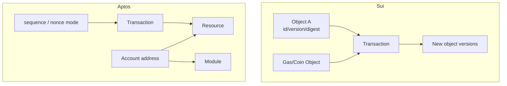

# Sui Object 与 Aptos Resource 模型对比

## 30 秒版（开场）

> Sui 和 Aptos 都使用 Move，但状态与交易模型不能合并。Sui 仍以带 ID、version、
> digest 和 ownership 的 object 为核心；同时 2026 年协议升级为支持资产引入
> Address Balances，资金路径不能再绝对化为只有 Coin Object。Aptos 以 account address
> 下的 resources/modules 为核心，传统交易用 sender sequence 防重放与排序，也在演进
> orderless 等能力。二者的 Move 方言、标准库、token、签名和 API 都应是独立 adapter。

## 3 分钟版（精讲深度）

1. **Sui object**：address-owned、shared、immutable 等 ownership；mutable object version 每次变更推进。
2. **Aptos resource**：resource 具有线性/稀缺语义，存于全局状态的地址与类型路径下；账户支持 key rotation 等能力。
3. **并发冲突**：Sui 重点看输入 objects，Aptos 传统路径重点看账户 sequence 与状态访问集合。
4. **钱包影响**：Sui 的 `Coin<T>` object 路径需要 coin selection/merge/split，但支持资产
   也可能使用 Address Balance 或 hybrid 路径；Aptos 资产标准和账户资源查询不同。

## 10 分钟版（原理 + 图示）

**Sui object reference 与 Address Balance**

交易通常需要 `(object ID, version, digest)` 的认证引用。若另一笔交易先修改同一 mutable object，旧引用会失效，需要重新读取和构建。钱包不能只保存 object ID。

Owned objects 的所有者控制使用；shared objects 需要全局共识排序，吞吐/延迟特征不同。不能简单说“Sui 所有交易都绕过共识”。

对启用了 Address Balances 的资产，资金与 gas 可以走地址余额或与 Coin Objects 组合的
hybrid 路径；当前部分稳定币转账还支持由 Address Balances 驱动、范围明确的 gasless 能力。这没有删除 object 模型，
也不代表所有 provider/network/资产同步支持。adapter 必须按 protocol version 与资产
能力发现，而不是把某一种模式写死。

**Aptos account/resource**

账户地址可持有 resources 和 modules，resource 不能被任意复制或丢弃。传统账户 sequence 确保顺序和防重放；当前生态还存在 stateless account、orderless transaction 等版本化能力，集成前必须按 network/protocol 发现，不能把旧文档或新特性泛化到所有链。

**都叫 Move，为什么不能复用全部代码**

- object/resource 和标准库 API 不同。
- 地址、交易 raw format、authentication、gas、事件与 finality API 不同。
- package 发布/升级和 token 标准不同。
- SDK/RPC 生命周期也不同。

可以复用领域 intent、审计和 signer policy，但 builder/parser 应独立。

## 生产场景

- Sui 提现：object 路径预占完整 refs；Address Balance 路径按 sender/asset 预占额度，
  hybrid 同时管理两类冲突域。
- Sui 归集：Coin Object 路径的小对象可能需要分批 merge；支持 Address Balance 时可减少
  碎片，但仍要按协议/provider 能力灰度。
- Aptos 提现：传统 sequence manager、gas estimation、simulation 和 key rotation aware。
- Indexer：同时保存 raw event/type、object/resource 变化和协议版本。

## 排查与工具

Sui 关注 object version mismatch、address-balance capability、shared object congestion、
gas mode、epoch/protocol version；Aptos 关注 sequence、expiration、gas、VM abort code、
resource/type 变化。错误码必须保留链原文并映射为稳定领域分类。

## 架构取舍

构建“Move adapter”只适合共享少量 BCS/领域工具；如果它隐藏 Sui/Aptos 状态差异，会让 nonce/object reservation 和恢复逻辑变得错误。宁可重复少量 glue code，也不要制造错误抽象。

## 深挖问答

1. **Sui object ID 足够重放交易吗？** → 不够；mutable input 还需要正确 version/digest。
2. **Sui 为什么能并行？** → 互不冲突的输入/owned objects 可独立处理；shared objects 仍需排序。
3. **Aptos resource 是普通 map value 吗？** → 不是；Move 类型系统限制复制/丢弃，存储路径与权限受模块控制。
4. **两个链都能用同一 Move 合约吗？** → 通常不能直接复用，方言、框架和 API 不同。
5. **资产 symbol 相同能合并吗？** → 不能；必须按 chain、type/object/metadata identity。
6. **Sui 现在是否不需要 Coin Object？** → 不是；Address Balances 与 Coin Objects 并存，按资产和协议能力选择。

## 反模式与事故

- Sui 并发交易重复使用同一个 gas/coin object。
- 只存 Sui object ID，失败恢复仍用过期 version。
- 继续绝对声称所有 Sui 资产和 gas 都只能走 Coin Object，或反向声称 Address Balance 已完全取代 object。
- 把 Aptos/Sui 都塞进 EVM nonce 接口。
- 因为都叫 Move 就共享序列化和签名实现，产生错误 payload。

## 延伸阅读

- [Sui Object Model](https://docs.sui.io/develop/sui-architecture/object-model)
- [Sui Transactions](https://docs.sui.io/concepts/transactions)
- [Aptos Accounts](https://aptos.dev/network/blockchain/accounts)
- [Aptos Global Storage](https://aptos.dev/build/smart-contracts/book/global-storage-structure)
- [S-WALLET-10 Aptos Go SDK BCS 实战](./S-WALLET-10-aptos-go-sdk-bcs-transaction.md)
- [S-WALLET-11 Sui Go 能力适配](./S-WALLET-11-sui-go-capability-adapter.md)
