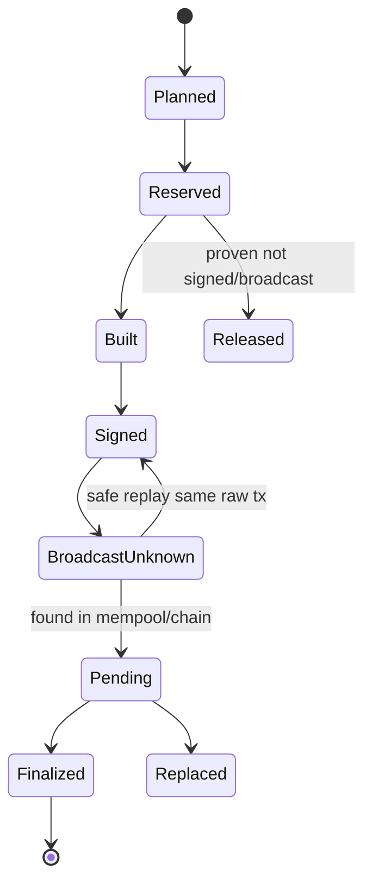

# 充值地址、归集、Nonce/UTXO 预占与恢复

## 30 秒版（开场）

> 钱包系统的关键不是“生成地址并转账”，而是让地址分配、链上 observation、最终性、
> 账本入账、归集、签名和广播都有可恢复状态机。EVM/Cosmos 预占 sender nonce/sequence，
> Bitcoin 预占 outpoints；Sui 的 object 路径预占 refs，Address Balance 路径预占
> sender/asset 额度；Solana 还要管理 writable accounts 与 blockhash。网络超时不代表失败：
> 必须先按已冻结 payload、raw tx 和链状态查询，再决定重播、替换或释放资源。

## 3 分钟版（精讲深度）

1. **地址分配**：链/network/derivation path/memo-tag 与用户映射唯一；在线系统尽量只持 xpub/地址能力。
2. **充值**：observed → safe/confirmed → finalized → credited；链上事件和内部账本分离。
3. **归集/提现**：先 reserve 冲突资源，冻结 payload，策略审批，签名，持久化 raw tx，再广播追踪。
4. **恢复**：worker crash 后从数据库状态和链事实恢复，不能依赖内存锁或“调用成功返回”。

## 10 分钟版（原理 + 图示）

**不同链的 reservation**

| 模型 | 预占对象 | 恢复关键 |
|------|----------|----------|
| EVM | sender + nonce | pending/confirmed nonce、同 nonce replacements |
| Bitcoin | outpoints | mempool/chain spender、conflicting tx |
| Cosmos | signer + sequence | committed sequence、mempool/broadcast mode |
| Solana | signing intent + blockhash/nonce、账户冲突 | signature status、blockhash expiry、业务幂等 |
| Sui Coin Object | object ID/version/digest + object gas inputs | latest object refs、executed effects |
| Sui Address Balance / Hybrid | sender + asset balance domain；hybrid 再加 object refs | capability/version、balance、object refs、executed effects |

Reservation 需要 durable record、owner、lease epoch/fencing token 和状态。lease 到期只能允许新的协调者接管，不能自动证明旧交易从未签名或广播。
Sui 的 `sender + asset` 在这里是钱包内部防超额预占的协调键，不是链上 nonce，也不是交易必须携带的 object ref；实现可以在原子额度约束下并发多个 intent，不必把“协调域”误讲成协议强制单线程。

**“未查到”不是不存在证明**：RPC/full node 可能只有 recent cache 或裁剪后的历史，provider 也可能暂时落后。释放 nonce/outpoint/object 或创建新 payload 前，要结合交易历史/归档查询、freshness 是否已确定过期、冲突资源当前状态、多个独立 provider 和业务状态；单次 `not found` 不足以完成这个证明。

**充值与归集**

- 地址池预生成，derivation index 单调持久化；不要从多个实例无锁派生同一 index。
- memo/tag 链必须把 address + memo/tag 作为路由键，并对缺失/错误 memo 进入人工流程。
- Token 归集可能需要原生 gas；gas top-up 本身也是资金工作流，需额度和回收策略。
- 小额 UTXO/token account 归集要考虑手续费经济性、dust 和批次上限。

**Exactly-once 边界**

数据库提交、签名器响应、RPC 广播和链上共识不在一个事务里。目标是：

- intent/idempotency 唯一；
- payload hash 冻结；
- 对这些确定性签名格式，同一 signed/raw bytes 会得到同一交易身份，可向多个 provider 重播；这不等于不同 attempt 的业务副作用自动幂等；
- 新 payload/replacement 有 lineage；
- 账本用唯一键与冲正抵御重复/重组。

## 生产场景

- 热钱包余额不足：自动归集/补 gas，但受 treasury policy 和限额控制。
- Provider 返回 timeout：进入 `BroadcastUnknown`，多 provider 查询 tx/raw input，不直接创建新交易。
- Reorg：充值 observation orphaned，未达到结算水位的不入账；已入账风险事件走冲正和告警。

## 排查与工具

每个 workflow 保存 intent ID、reservation、unsigned payload hash、signing session、raw tx digest、所有 tx IDs、provider responses、finality evidence 和 ledger reference。指标按状态年龄、卡住原因、replacement 数和资源预占时间统计。

## 架构取舍

单 writer per conflict domain 最容易证明正确；高吞吐时可做分片 owner/lease，但必须保证同一 nonce domain、UTXO 或 object 不被多 writer 同时控制。不要为了“无锁高并发”牺牲资金确定性。

## 深挖问答

1. **广播超时能否释放 nonce/UTXO？** → 不能；先查交易和冲突资源是否已被消费。
2. **归集是否越频繁越好？** → 否；要权衡热钱包暴露、手续费、碎片和提现流动性。
3. **同 raw tx 重播会双扣吗？** → 同一 signed bytes 通常对应同一交易身份，重播本身不会变成第二个不同交易；但若已经重建/重签了新 attempt，或内部处理重复，仍必须靠 lineage 与账本幂等防双扣。
4. **lease 过期代表旧 worker 不会广播吗？** → 不代表；需 fencing + 状态查询，签名后的交易可能延迟广播。
5. **如何处理 token gas？** → 预估、top-up、归集后回收/限额，并把原生币工作流纳入对账。
6. **Sui 都锁 gas object 吗？** → 不再能绝对化；按 object、address-balance 或 gasless 能力选择并记录模式。

## 反模式与事故

- 地址 derivation index 只存在 Redis，数据丢失后重复分配。
- 多实例各自读 pending nonce 并签名。
- RPC timeout 立即签新 payload，产生两笔都可能成功的业务交易。
- 单个 provider 返回 `not found` 就释放预占，忽略 recent-cache/历史裁剪和节点落后。
- 归集只看链上余额，不与内部用户负债、pending 提现和 gas 需求联合计算。

## 延伸阅读

- [Bitcoin Payment Processing](https://developer.bitcoin.org/devguide/payment_processing.html)
- [Ethereum Transactions](https://ethereum.org/developers/docs/transactions/)
- [Solana Transactions](https://solana.com/docs/core/transactions)
- 关联：[S-BC-05 链上索引器](../12-blockchain-web3/S-BC-05-indexer-reorg.md)
