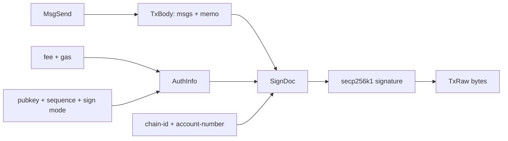

# Cosmos SDK Go 实战：TxBuilder、SIGN_MODE_DIRECT 与 Sequence

## 30 秒版（开场）

> Cosmos SDK 交易不是“把 Msg JSON 用 secp256k1 签一下”。`SIGN_MODE_DIRECT` 的 SignDoc
> 绑定序列化后的 body bytes、auth info bytes、chain ID 和 account number；auth info
> 又包含 signer info/sequence、fee 和 gas。构建时先设置空签名以生成正确 signer info，
> 获取 sign bytes 后签名，再写回 SignatureV2 并编码 TxRaw。广播 `sync` 的 CheckTx 成功
> 不代表交易已提交到区块或应用执行成功；“DeliverTx”是旧 ABCI 常见术语，ABCI++ 版本通常
> 在 `FinalizeBlock` 中产生每笔交易的执行结果，客户端应统一检查 committed tx result。

## 3 分钟版（精讲深度）

1. 为目标 app 注册 interface registry、消息类型、address prefix 和 TxConfig。
2. 用官方 `TxBuilder` 设置 `MsgSend`、memo、gas、fee。
3. 先写入带公钥、sign mode 和 sequence 的空 `SignatureV2`，使 AuthInfo 完整。
4. 用 `SignerData{chainID, accountNumber, sequence}` 生成 DIRECT sign bytes 并签名。
5. 编码 tx bytes，保存签名输入与 raw tx，再广播和查询最终 `code/log/height`。

可运行示例固定 Cosmos SDK v0.53.7：

```bash
cd examples/non-evm-sdk/cosmos
GOMAXPROCS=2 go test -p=1 ./...
```

## 10 分钟版（原理 + 图示）



### 哪些字段会改变签名

| 字段 | 所在层 | 改变后 |
|------|--------|--------|
| messages / memo | TxBody | 必须重签 |
| pubkey / sequence / sign mode | AuthInfo | 必须重签 |
| fee / gas | AuthInfo | 必须重签 |
| chain ID / account number | SignDoc | 必须重签 |

因此签名器应接收并审计规范化 sign bytes 及可解释摘要，不能只相信调用方提供的
`to/amount` 文本。

### Sequence 与 unordered 能力

传统账户交易使用 sequence 防重放。同一 signer 的并发 worker 若各自查询链上 sequence，
会构造冲突交易。应由 durable sequence manager 预占，广播未知时先查询 tx 与 committed
sequence，再决定重播或重建。

Cosmos SDK 从 v0.53.0 起还支持由目标链显式启用的 unordered transaction：它必须把
sequence 留为零，并用唯一 timeout timestamp 等机制防重放，额外 gas 与 ante-handler
规则也可由链配置。这不表示所有 Cosmos 链都已启用；本文 v0.53.7 示例构建的是传统
sequence 交易。讲解时应先说“按 chain/app capability 选择”，不能把 sequence manager
永久泛化到 unordered 路径。

### 广播模式

`broadcast_tx_sync` 通常只等待 CheckTx；进入 mempool 不等于已经执行。即使被打包，也要看
committed transaction result 的 code、events 和 height。旧接口/资料可能把这层称为
DeliverTx；ABCI++ 栈通常通过 FinalizeBlock 产生 `ExecTxResult`。不同 CometBFT/Cosmos app
可能禁用或调整某些模式，adapter 应保留原始响应并按实际版本解码。

### App-specific 不是小细节

Cosmos SDK 链共享框架，但模块、消息类型、denom、Bech32 prefix、fee token、sign mode、
extension options 和升级高度都可能不同。示例只注册 crypto 与 bank `MsgSend`，不能直接
声称适用于所有 Cosmos 链。

## 生产场景

- 对传统有序交易，每个 chain ID 独立 sequence domain 与配置，禁止仅按 address 共享 sequence；unordered 路径则使用链启用的独立防重放规则。
- 交易 build/simulate/sign 之间冻结 account number、fee、gas、消息 bytes，以及传统 sequence 或 unordered flag + timeout timestamp。
- 超时后查询 tx hash、mempool 与对应防重放状态；传统路径还要查询账户 sequence，不能仅凭请求超时释放预占。
- 链升级前用官方节点/CLI 做 golden vector，对比 sign bytes、tx hash 与执行结果。

## 排查与工具

保存 TxBody/AuthInfo/SignDoc 或其 hash、account number、sequence/timeout timestamp、chain ID、
raw tx、CheckTx 与 committed execution result（旧栈常称 DeliverTx）响应。常见错误按
`wrong sequence`、`insufficient fee`、`out of gas`、`unauthorized` 和 app-specific
codespace 分类。

## 架构取舍

直接依赖完整 Cosmos SDK 能获得官方类型与编码，但依赖图较大；薄 RPC/Protobuf 客户端更轻，
却需要自己保证 interface registry 和 sign mode 正确。无论选择哪种，都应放在独立 adapter/
module 中，避免把链 SDK 依赖扩散到核心账务。

## 深挖问答

1. **为什么先设置空签名？** → 让 builder 生成带 signer info/sequence 的 AuthInfo，再计算正确 sign bytes。
2. **sequence 在哪里签进去？** → AuthInfo 的 signer info；SignerData 同时参与签名流程。
3. **sync 返回 code 0 是否完成？** → 只代表 CheckTx 通过，仍需查询上链执行结果。
4. **同地址跨两条 Cosmos 链共用 sequence 吗？** → 不共用；chain ID 与各链账户状态独立。
5. **能否只用 JSON 签名？** → DIRECT 使用 protobuf 编码；其他 sign mode 也必须按链支持明确选择。
6. **Cosmos 交易都必须递增 sequence 吗？** → 传统交易是；SDK 0.53+ 的 unordered 交易在链启用后使用零 sequence + 唯一 timeout timestamp，必须按目标 app 能力判断。

## 反模式与事故

- 漏掉 chain ID、account number 或 sequence，仍声称签名可防跨链重放。
- 多 worker 无预占地并发读取同一 sequence。
- 看到 SDK 有 `SetUnordered` 就假定所有目标链已经启用，或给 unordered 交易填非零 sequence。
- CheckTx 成功立即记账为 settled。
- 所有 Cosmos 链共用一套 prefix、denom 和 interface registry。
- 交易失败后不保存 codespace/code/raw log，无法定位 app 模块错误。

## 代码示例

```go
signed, err := cosmostx.BuildSignedBankSend(ctx, cosmostx.BuildInput{
    Secret:        secret,
    AddressPrefix: "cosmos",
    Recipient:     recipient,
    Denom:         "uatom",
    Amount:        1_000,
    FeeAmount:     250,
    GasLimit:      200_000,
    ChainID:       "cosmoshub-4",
    AccountNumber: 7,
    Sequence:      42,
})
```

测试会证明修改 chain ID 或 sequence 会改变 sign bytes。endpoint adapter 另实现 CometBFT
`status`、`broadcast_tx_sync` 与按 hash 查询 committed tx，并分别保留 CheckTx 和 committed
execution 的原始 code/codespace/log；后者在旧栈/旧资料中常被称为 DeliverTx。它仍不替代
app-specific 账户查询、simulate 和业务 finality。
外网 smoke 必须校验预期 chain ID，不能只凭 endpoint 返回 HTTP 200 判定连对了网络。

## 延伸阅读

- [Cosmos SDK transactions](https://docs.cosmos.network/sdk/latest/node/txs)
- [Cosmos SDK encoding](https://docs.cosmos.network/sdk/latest/learn/concepts/encoding)
- [S-WALLET-04 Cosmos、CometBFT 与 IBC](./S-WALLET-04-cosmos-cometbft-ibc-sequence.md)
