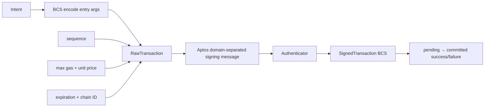

# Aptos Go SDK 实战：BCS 交易、域分离签名与执行跟踪

## 30 秒版（开场）

> Aptos 的 RawTransaction 明确绑定 sender、sequence、payload、gas、expiration 和 chain ID，
> Entry Function 参数要按 BCS 类型序列化；签名使用 Aptos 定义的域分离消息，不能自己对
> JSON 随便 hash。示例因项目使用 Go 1.24 固定官方 SDK v1.13；官方仓库建议新项目评估 v2，
> 但版本结论必须绑定具体 tag/commit：截至 2026-07-18，v2 的 `main` 分支 `go.mod` 声明
> Go 1.25 与 toolchain 1.25.10，这不能反推所有已发布 v2 tag 或未来 `@latest` 都是同一要求。
> 本示例是 Go 1.24 的兼容选择，不应说成最新。提交成功后仍要查询 committed
> transaction 的 `success` 与 VM status。

## 3 分钟版（精讲深度）

1. 查询账户 sequence、ledger chain ID、gas estimate 和可信 ledger timestamp。
2. 构造 Entry Function，按 ABI/类型把地址、`u64` 等参数 BCS 序列化。
3. 冻结 RawTransaction：sequence、gas、expiration、chain ID 都是签名内容。
4. 用官方 SDK 生成域分离 signing message、签名并本地 verify，再持久化 signed BCS/hash。
5. 广播同一 bytes，按 hash 查询 pending/committed；只有 committed 且 `success=true` 才算执行成功。

可运行离线示例：

```bash
cd examples/non-evm-sdk/aptos
go test ./...
```

## 10 分钟版（原理 + 图示）



### RawTransaction 的安全字段

| 字段 | 作用 |
|------|------|
| sender + sequence | 防重放并定义传统账户顺序 |
| payload | 实际 Move 调用和 BCS 参数 |
| max gas + gas unit price | 费用上限和竞价 |
| expiration timestamp | 限制交易可接受时间 |
| chain ID | 防止跨网络复用 |

修改任何字段都必须重新签名。签名器应展示可解释 payload，同时保存实际 signing message
hash，不能只审查外层业务 JSON。

### SDK 版本表达

`aptos-go-sdk` 是 Aptos Labs 官方仓库。仓库当前引导新项目使用 v2 API，但版本要求也要
与项目 Go toolchain 对齐。Aptos 官方文档的安装页当前仍展示根模块，而仓库 README 明确
建议新项目使用 v2，因此不能只凭一个页面写“唯一推荐版本”。截至 2026-07-18，仓库 v2
`main` 的 `go.mod` 是 `go 1.25.0`、`toolchain go1.25.10`；这是移动分支快照，不是
`v2@latest` 的永久契约，也不能替代检查所选 release tag 的 `go.mod`。本题固定 v1.13.0
以保持 Go 1.24 可运行；迁移时应固定具体 v2 tag/commit，再验证 API、toolchain 和 golden vectors。

### Sequence 与新账户能力

传统账户按 sequence 排序；生态也在演进 key rotation、multi-key、orderless 等能力。
当前官方 orderless transaction 用唯一 `replayProtectionNonce` 防重放，可在其 expiration
窗口内乱序执行；官方文档给出的最大 expiration 是 60 秒。它不提供 sequence 的执行顺序
保证，也不是“随便不填 sequence”就自动生效。adapter 不能把所有交易永久硬编码成
“一个 Ed25519 key + 严格 sequence”，应按 transaction variant、账户 authenticator 与
网络能力选择；同样不能把新能力泛化到未支持的网络/账户。

### 提交与执行

REST 接受 signed transaction 不代表 Move VM 执行成功。后端需要区分：

```text
BUILT -> SIGNED -> SUBMITTED -> PENDING
      -> COMMITTED_SUCCESS | COMMITTED_FAILED | EXPIRED_UNKNOWN
```

VM abort、out of gas、sequence too old/new 都必须保留原始错误和 ledger version。

## 生产场景

- 签名前 simulation，比较 gas、write set/事件预期和 policy；模拟结果仍不是最终保证。
- 传统交易由 durable sequence manager 管理；orderless 路径则保证 replay-protection nonce 唯一并受短 expiration 约束。两者超时都先查 hash/链状态再创建新 attempt。
- 用 ledger timestamp 计算 expiration，避免应用服务器时钟漂移造成大面积过期。
- 解析资产时按 type/address/module identity，不按 symbol 合并。

## 排查与工具

保存 raw/signed BCS、transaction hash、sequence、expiration、chain ID、SDK 版本、simulation
与最终 VM status。用官方 SDK 本地 verify，必要时与 CLI/REST 返回的 hash 和 decoded payload
交叉验证。

## 架构取舍

使用官方 SDK 可减少 BCS/Authenticator 错误，但升级会影响 API 与 Go toolchain；把 SDK
隔离在独立 module 能控制依赖。手写序列化看似轻量，除非有完整官方向量与审计，否则
不值得承担签名错误风险。

## 深挖问答

1. **为什么不能签 JSON？** → 链验证的是协议定义、带域分离的 RawTransaction signing message。
2. **expiration 用本机时间可以吗？** → 应参考可信 ledger time 并设置策略余量。
3. **提交返回 hash 是否成功？** → 不是；要等 committed 并检查 `success/VM status`。
4. **为什么没直接用 SDK v2？** → 当前示例固定 Go 1.24 + v1.13；仓库建议新项目评估 v2，但必须先检查目标 v2 tag 的 Go 要求与迁移差异，不能拿移动的 `main` 或 `@latest` 代替版本决策。
5. **sequence 冲突怎么恢复？** → 查询已提交 hash和链上 sequence，判断重播、已执行或重新构建。

## 反模式与事故

- 自己拼 JSON/hash，忽略 Aptos 域分离与 BCS。
- 把 SDK v1.13 说成当前推荐最新主版本。
- 修改 gas/expiration/sequence 后复用签名。
- HTTP 提交成功就记为链上执行成功。
- 假设所有 Aptos 账户都永远只有单 Ed25519 authenticator。

## 代码示例

```go
signed, err := aptostx.BuildSignedTransfer(aptostx.TransferInput{
    PrivateKeySeed:    seed,
    Recipient:         recipient,
    Amount:            1_000,
    Sequence:          9,
    MaxGasAmount:      2_000,
    GasUnitPrice:      100,
    ExpirationSeconds: expiration,
    ChainID:           1,
})
```

示例的离线路径验证 BCS、签名和 transaction hash；REST adapter 另实现 ledger identity、
signed BCS 广播和按 hash 查询，并把 pending、committed success 与 committed VM failure
分开。它仍不包含生产 sequence/gas manager、simulation policy 或自动重签；外网 smoke
默认只读，只有显式提供已签 BCS 才允许广播。

## 延伸阅读

- [Aptos Go SDK](https://github.com/aptos-labs/aptos-go-sdk)
- [Aptos Go SDK v2 go.mod](https://github.com/aptos-labs/aptos-go-sdk/blob/main/v2/go.mod)
- [Aptos Go SDK documentation](https://aptos.dev/build/sdks/go-sdk)
- [Aptos orderless transactions](https://aptos.dev/build/guides/orderless-transactions)
- [Aptos accounts](https://aptos.dev/network/blockchain/accounts)
- [S-WALLET-05 Sui Object 与 Aptos Resource](./S-WALLET-05-sui-aptos-state-model.md)
