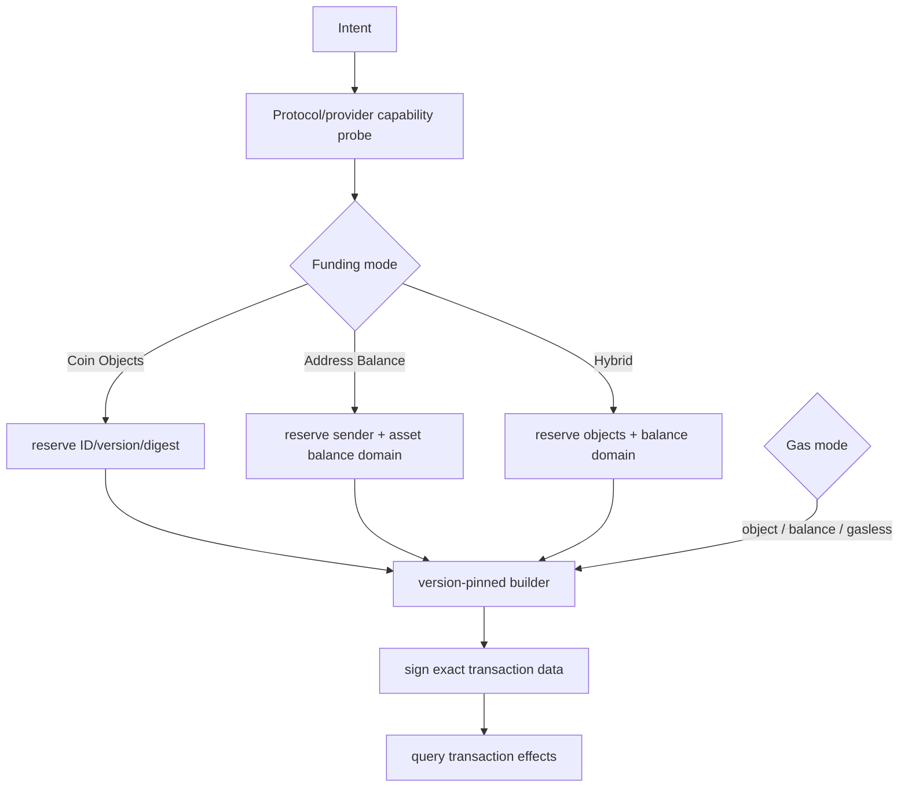

# Sui Go 集成实战：Object、Address Balance 与能力演进

## 30 秒版（开场）

> Sui 不能再绝对表述为“所有 Coin 和 Gas 都必须选 Coin Object”。2026 年协议升级引入
> Address Balances，与 `Coin<T>` object 路径并存，并支持 address-balance/hybrid gas；
> 部分稳定币还有由 Address Balances 驱动的 gasless transfer。Go 侧没有可以无条件当作官方稳定交易 SDK 的统一结论，
> 所以生产做法是版本固定的 adapter + capability probe：对象路径预占
> `(ID, version, digest)`，地址余额路径按 sender/asset 做持久化额度预占；这是一种应用协调键，
> 不是 Sui nonce，在原子防超额的前提下可允许并发 intent。最终以 transaction
> effects 为事实，而不是 RPC 接受提交。

## 3 分钟版（精讲深度）

1. **能力发现**：按 network、protocol version、provider 查询 Address Balance、gas mode、GraphQL/gRPC 方法与 gasless asset allowlist。JSON-RPC 已被官方标记 deprecated，并计划于 2026 年 7 月停用；截至 2026-07-18，迁移页公告公共端点 Testnet 在 7 月 6 日当周、Mainnet 在 7 月 20 日当周关闭。私有 provider 的实际时间仍需核对，不能说成“所有端点已经同时停用”。
2. **资金路径**：明确 `COIN_OBJECTS`、`ADDRESS_BALANCE` 或 `HYBRID`，不能由 worker 临时猜测。
3. **资源预占**：object path 锁定完整 object ref；address-balance path 用 sender + asset 的应用级额度预占防止内部超额。它不必等价为全局串行，关键是原子维护 `available - reserved`。
4. **Gas**：可能来自 gas coin objects、address balance，或协议允许的 gasless transfer；每种能力都要显式校验。
5. **执行事实**：保存 transaction bytes/digest 和 effects，失败后重读对象版本/余额再决定重建。

可运行的能力与预占边界示例：

```bash
cd examples/non-evm-sdk/sui
go test ./...
```

## 10 分钟版（原理 + 图示）



### 需要修正的旧表述

旧说法“每次 Sui 转账都必须 coin selection/merge/split，并额外选择 gas object”只适用于
Coin Object 路径。当前正确说法是：

- `Coin<T>` objects 仍然存在，object transaction 仍需正确的 ID/version/digest；
- Address Balances 为支持的资产提供账户余额式路径；
- 资金与 gas 可按协议支持组合成 object、address balance 或 hybrid；
- 当前官方 gasless stablecoin transfer 由 Address Balances 驱动，只对明确支持的
  资产/交易生效；不能推断 Coin Object、hybrid 或任意 Move 调用也免 gas；
- 不同 provider、网络和协议版本可能并非同时支持全部能力。

### 为什么能力演进会改变并发模型

| 模式 | 冲突/预占键 | 失败恢复 |
|------|-------------|----------|
| Coin Objects | object ID + version + digest | 查询最新 object/effects，旧 ref 不可静默替换 |
| Address Balance | 应用键：sender + asset + reserved amount | 查询余额/effects，原子防内部超额；不是协议 nonce/交易 input |
| Hybrid | 两类键同时占用 | 必须原子管理两侧 reservation |

Address Balance 减少碎片和 coin merge 需求，但不意味着可以无约束并发花同一账户余额；
只是冲突域从具体 object 转为账户/资产额度。

### Go SDK 与 adapter 边界

不要为了简历好看虚构“一个官方 Go SDK 已稳定覆盖所有 Sui 交易能力”。官方当前提供
gRPC protobuf，可生成 typed Go client；迁移指南默认把 gRPC 用于 full-node live path 与交易
执行，把 GraphQL 用于索引、过滤和关联读取。GraphQL 也暴露模拟与交易提交，但这不等于它在
所有后端场景都优于 gRPC。工程上仍应把 transaction builder、schema/proto、BCS、签名和
effects parser 封装在版本化 module，并用官方 CLI/Rust/TypeScript 实现生成 golden vectors。
协议升级必须先 shadow read/build。

当前 GraphQL 写路径还要避免两个字段误用：GraphQL 顶层 `errors` 表示请求/解析错误；
`executeTransaction` 的业务执行结果在 `effects.status` 与 `effects.executionError`。交易 ID 应取
`effects.transaction.digest`，不能拿 effects digest 冒充 transaction digest。具体 selection
set 必须按 provider 的 GraphQL schema 版本/introspection 固定并回归测试，不能把示例字段路径
当成永不变化的 wire contract。

### 升级与可用性

2026 年 Address Balance 随 1.72 上线后，Sui 主网在 5 月 28、29 日经历三次停机；官方复盘
说明前两次与 address-balance/gas charging 交互有关，第三次是重启后 randomness 状态问题，
恢复时没有回滚已提交交易，也没有用户资金风险。这说明“能力已发布”和“所有路径已经成熟”
不是同一件事。钱包应在升级时提高监控和暂停阈值，但也不能把一次事故泛化成永久不安全。

## 生产场景

- 归集策略根据资产与 provider capability 选择 object、balance 或 hybrid，不硬编码链名分支。
- object 模式避免同一 gas/coin object 被并发交易复用；失败后保留旧 reservation 直到查明 effects。
- gasless 资产使用 allowlist、版本和额度策略，防止错误地对任意 token 开启。
- provider 结果不一致时暂停 build，保留 protocol version 与原始响应供审计。

## 排查与工具

保存 protocol version、capability snapshot、funding/gas mode、所有 object refs、balance
reservation、transaction bytes/digest、provider 和 effects。排查时先判断是 stale object、
余额冲突、能力未启用、协议升级还是执行 abort。

## 架构取舍

Coin Object 路径冲突边界清晰但可能碎片化；Address Balance 简化支付体验但需要账户级
额度协调；Hybrid 提供迁移弹性却增加恢复复杂度。选择应由资产能力和吞吐模型决定，
不能把任一模式描述成全面替代另一模式。

## 深挖问答

1. **Sui 是否不再有 Coin Object？** → 仍有；Address Balances 是并存能力，不是删除 object 模型。
2. **Address Balance 是否等于 EVM nonce？** → 不是；`sender+asset` reservation 是钱包应用的额度协调键，不是链上递增序号，协议仍按 Sui 交易语义执行。
3. **gasless 是否所有 token 都支持？** → 不是，必须按协议与资产 allowlist 发现。
4. **旧 object ref 能否自动换成新 version 后重发？** → 不能静默替换；会改变签名 payload，需重建与重签。
5. **没有官方 Go SDK 怎么上线？** → 版本化 adapter、官方向量交叉验证、testnet/主网只读 shadow 和严格升级门禁。

## 反模式与事故

- 继续绝对声称所有 Sui 资产/Gas 都必须 Coin Object。
- 看到 Address Balance 后又反向声称 object reservation 已无意义。
- 把 gasless 当作所有 Move 调用都免 gas。
- 把应用侧 `sender+asset` reservation key 说成 Sui 协议 nonce，或反过来完全不做内部额度预占。
- 把“计划于 2026 年 7 月停用 JSON-RPC”说成所有私有 provider 已在同一时刻关闭。
- 使用未固定版本的社区 builder，协议升级后直接生成主网交易。
- RPC 返回 digest 就释放对象/余额 reservation，不查询 effects。

## 代码示例

```go
if err := intent.Validate(capabilities); err != nil {
    return err
}
keys := intent.ReservationKeys()
// durable、带 fencing 的协调器原子预占 keys，再由版本固定的 adapter 构建交易。
```

`examples/non-evm-sdk/sui/` 刻意不伪装成完整交易 SDK：它保留 object/
address-balance/gasless 的能力验证与预占，并增加面向当前官方 GraphQL schema 的链身份探测、
已签交易提交和 effects 查询。adapter 接收外部构建并签好的 BCS 与签名；BCS builder、密钥保管、
participant 隔离和生产 provider 仍是独立边界，不能从“能调用 endpoint”推断已经完成托管钱包。

## 延伸阅读

- [Sui releases](https://github.com/MystenLabs/sui/releases)
- [Sui JSON-RPC migration](https://docs.sui.io/develop/accessing-data/json-rpc-migration)
- [Sui GraphQL RPC](https://docs.sui.io/develop/accessing-data/graphql/graphql-rpc)
- [Sui gasless stablecoin transfers](https://blog.sui.io/sui-launches-gasless-stablecoin-transfers/)
- [Sui mainnet upgrade incident review](https://blog.sui.io/sui-mainnet-halts-resolved-after-major-upgrade/)
- [S-WALLET-05 Sui Object 与 Aptos Resource](./S-WALLET-05-sui-aptos-state-model.md)
