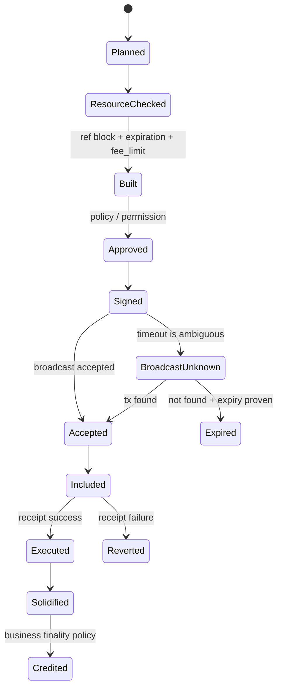
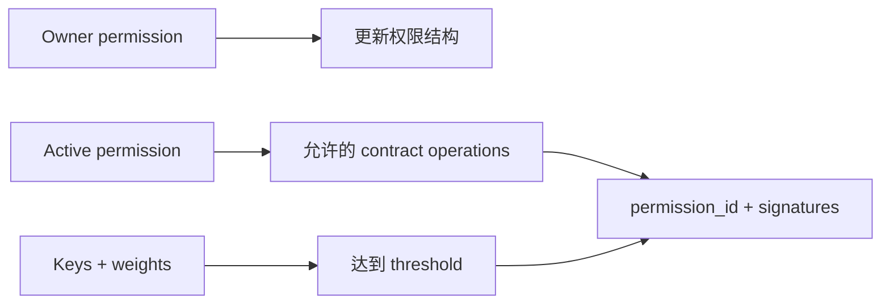

# TRON / TRC20 钱包：资源、权限与交易生命周期

<a id="oral-card"></a>

## 要点卡

[返回 P0 知识图谱](../_meta/p0-knowledge-graph.md)

!!! abstract "30 秒回答"

    TRON 不能当作“换 RPC 的 EVM”。它没有 Ethereum 式账户 nonce，交易绑定近期区块引用和
    expiration；费用是 Bandwidth、Energy 与不足时燃烧 TRX，合约调用还受 `fee_limit` 约束。
    签名要建模 owner/active permission、operation、threshold 和 `permission_id`。
    充值则校验目标合约、Transfer log、执行结果、canonical/solidified 状态和业务唯一键，
    广播 timeout 先按原 txID 查证，不能立即重建。

**3 分钟展开**

1. 地址常用 `41` 开头 hex 或 Base58Check `T...`；这是 TRON 地址编码，不能仅凭地址区分 mainnet/testnet，
   实际网络身份来自配置的节点/环境与交易上下文。
2. 构建后冻结 raw bytes、txID、ref block、expiration、fee limit 和 intent lineage；签名后任何字段变化都会改变交易。
3. 资源余额、Energy 单价/动态因子和合约状态会变；估算只是输入，`fee_limit` 是按网络/合约/业务策略设置的风险上限。
4. full-node view、solidified view 和业务 credited/finalized 水位分开；查询到 tx 或 event 不等于执行成功和最终入账。

| 记忆槽 | 内容 |
|--------|------|
| 三个不变量 | 无 Ethereum 式 nonce；广播成功不等于执行/最终；TRON 多签不等于 MPC |
| 手画图 | `intent → resource check → build → policy/permission → sign → broadcast? → receipt → solidified → ledger` |
| 项目落点 | 用真实 TRC20 USDT 充值/提现、资源治理、active permission 与补扫对账证据讲生产经验 |
| 一个取舍 | 第三方 provider 接入快；自有节点/索引可控性高但升级、存储和一致性治理成本更高 |

**错误表达**

- ❌ “TRON 地址前缀能区分主网测试网；查到 Transfer 或广播成功就可以入账。”
- ✅ “网络由节点/环境上下文确定；还要校验 receipt、canonical/solidified 与业务确认策略。”

**自测追问**：广播超时且多个节点暂时 `not found` 时，何时才能创建带新 ref block 的 attempt？

## 10 分钟版（原理 + 图示）



### 与 Ethereum 钱包的关键差异

| 维度 | TRON | 讲解时不要说 |
|------|------|--------------|
| 防旧交易/有效期 | recent block reference + expiration | “TRON 也靠 account nonce 排序” |
| 资源/费用 | Bandwidth、Energy、TRX burn、fee limit | “就是 gasPrice × gasLimit” |
| 地址 | Base58Check/hex 与 TRON 地址前缀；网络由节点/环境上下文确定 | “地址本身能区分主网测试网” |
| 权限 | owner/witness/active、operation、threshold、permission ID | “只有私钥对应地址一种权限” |
| 确认查询 | full-node view 与 solidified view 有区别 | “接口查到就是最终入账” |
| 合约执行 | inclusion 与 receipt/result 分离 | “广播成功就代表 TRC20 转账成功” |

TRON 与 EVM 都能执行 Solidity 风格合约，也都使用 secp256k1，但这只是部分相似性。交易 envelope、
资源计费、权限和确认接口仍要在 Chain Adapter 中显式建模。

### 资源与费用

- **Bandwidth** 与交易字节规模有关；普通转账和合约调用都需要。
- **Energy** 用于 TVM 智能合约计算，TRC20 `transfer` 属于合约调用。
- stake/delegation、免费额度、资源恢复、单价与 dynamic Energy 参数都可能变化。
- 调用前可估算 Energy，但估算不是绝对保证；热门合约的动态因子和链参数可能使实际消耗变化。
- `fee_limit` 是业务风险上限，不应写死成全局常量；按 token/contract/network/version 建策略并监控。
- 提现和归集要同时规划 TRC20 余额与 TRX/资源，不能只看 token 余额。

### 交易构建与签名

建议冻结并持久化：

```text
intent_id
network
owner_address
permission_id
contract_address + method + canonical args
ref_block / expiration
fee_limit
raw_data_bytes + tx_id
signature set
attempt lineage
```

同一 raw transaction 重播对应同一 txID；如果 ref block 过旧或 expiration 已过，需要创建新 attempt，
它应链接到原业务 intent，而不是覆盖原交易。广播返回 timeout 时先查 txID、receipt 和账户/合约事件；
只有确认旧交易已过期且未被接受，才可重建。

### 权限与多签



- `OwnerPermission` 权限最高，生产热路径尽量不使用 owner key。
- `ActivePermission` 应只开放转账/合约调用所需 operation，并限制 key/threshold。
- 交易必须声明正确 `permission_id`；签名权重达到 threshold 才可执行。
- TRON 原生多签描述“一个账户的链上权限”；MPC/TSS 描述“如何在链下共同生成签名”。两者可组合，
  但不能混为同一个概念。
- 权限更新会覆盖账户权限配置，属于高危变更：双人复核、完整快照、模拟验证和恢复预案不可少。

### TRC20 充值

索引器流程：

1. 跟随 block height/hash，保存 canonical lineage。
2. 解析 TransactionInfo 中的 event logs，校验目标合约和 `Transfer` topic。
3. 校验交易执行成功，不能只因出现 txID 或 block inclusion 就入账。
4. 使用 `network + tx_id + contract + log_ordinal` 唯一，避免重复回调。
5. 地址做严格编码/网络校验，金额按 token decimals 使用整数。
6. 达到业务确认/solidified 水位后入账；索引回滚时 orphan observation，不直接删除账本事实。

第三方历史 API 可用于查询和补偿，但生产充值索引不能只依赖一个 provider 的“账户交易列表”；要保存
自己的扫块水位、原始区块/receipt 证据和 backfill 能力。

## 生产场景

- **TRC20 USDT 提现**：先 reserve 用户账本与热钱包额度，检查 TRX/Energy，冻结 raw data，
  走 active permission/MPC 签名，广播后按 txID 追踪 execution 和 solidification。
- **归集**：大量地址有 token 无 TRX/资源时，gas top-up/资源 delegation 是独立资金工作流，
  需要额度、回收和防滥用策略。
- **充值补扫**：provider 漏事件时按区块扫块水位回扫 TransactionInfo，与 ledger observation 对账，
  不以第三方分页 token 作为唯一事实。

## 排查与工具

监控至少包括：

- full node/solidity node 的 head height、solidified height 和差值；
- build→broadcast、broadcast→included、included→solidified 时延；
- Bandwidth/Energy 使用、TRX burn、fee limit exhaustion；
- broadcast timeout、expired、duplicate、receipt failure；
- event indexer lag、同一 tx 的解析差异、充值对账差异；
- permission ID/threshold 错误与签名权重不足。

排查顺序：先查 raw data/txID 是否一致，再查广播与 inclusion，最后查 receipt/result/event 和
solidified 状态；不要只盯 HTTP 状态码。

## 架构取舍

| 方案 | 优点 | 风险 |
|------|------|------|
| 自建 FullNode + SolidityNode | 数据和确认视图可控 | 运维、存储和升级成本 |
| TronGrid/第三方 provider | 接入快、查询方便 | 限流、延迟、历史与供应商语义 |
| 多 provider + 自有索引 | 容灾与交叉验证 | 成本与数据差异治理 |

资金路径应让自有状态机和链上证据成为事实源；provider 是传输/查询通道，不是内部账本。

## 深挖问答

1. **TRON 有 nonce 吗？** → 没有 Ethereum 式账户 nonce；交易使用近期区块引用和 expiration 防旧/过期，业务并发仍需自己做 intent/reservation。
2. **为什么 Energy 估算后还会失败？** → 资源余额、动态 Energy、合约状态或网络参数可能变化，且 fee limit 是上限。
3. **查到 Transfer 日志就能入账吗？** → 不能；还要校验合约、执行结果、canonical/solidified 状态和业务唯一键。
4. **TRON 多签等于 MPC 吗？** → 不等于；前者是链上 permission/threshold，后者是链下签名生成协议。
5. **广播超时怎么办？** → 保留原 raw/txID，多节点查询；未证明旧交易失效前不创建同业务的新 attempt。
6. **为什么热钱包不用 owner permission？** → owner 可改权限结构，爆破半径大；日常转账应使用最小 operation 的 active permission。

## 反模式与事故

- 把 Ethereum nonce manager 直接复用到 TRON，制造不存在的协议假设。
- `fee_limit` 全链统一写死，热门合约或网络参数变化后大面积失败。
- 只按 txID 去重，忽略同一交易可包含多个目标 event。
- 只看 block inclusion，不看合约执行 receipt，失败交易被错误入账。
- owner key 常驻在线 signer，active permission 没有限制 operation。
- provider `not found` 就释放业务 reservation，忽略节点落后和查询视图差异。

## 延伸阅读

- [TRON Resource Model](https://developers.tron.network/docs/resource-model)
- [TRON Account and Address Formats](https://developers.tron.network/docs/account)
- [TRON Transaction Lifecycle](https://developers.tron.network/docs/tron-protocol-transaction)
- [TRON Account Permission Management](https://developers.tron.network/docs/multi-signature)
- [TRC20 Contract Interaction](https://developers.tron.network/docs/trc20-contract-interaction)
- [TRON Event Log](https://developers.tron.network/docs/event)
- 关联：[S-WALLET-01 Chain Adapter](./S-WALLET-01-chain-adapter-capability-matrix.md)、
  [S-WALLET-06 归集与恢复](./S-WALLET-06-deposit-sweep-reservation-recovery.md)
