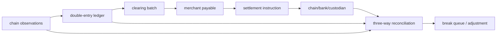

# 支付账本、清结算与三方对账

## 30 秒版（开场）

> 清算是计算各方应收应付，结算是实际转移最终价值；链上确认、内部账本入账和商户出款不是同一个时点。支付账本应双分录、不可变、按资产平衡，available/pending/reserved 分账户表达；错误用 reversal 抵消。对账至少比较内部账本、链/托管事实和支付/银行/provider statement，差异进入 break queue，有 owner、证据、SLA 和调整流水，不能直接改余额“抹平”。

## 3 分钟版（精讲深度）

1. **账本**：每个 transaction 多条 entries，总借贷/正负额按资产为零。
2. **清算**：按 merchant、currency、周期计算 gross、fee、refund、reserve、net payable。
3. **结算**：生成 payout instruction，预占资金，外部转移，确认后完成；失败释放或重试。
4. **对账**：transaction-level matching + balance proof，识别 timing、duplicate、missing、
   amount/fee mismatch；链确认、托管入账、银行不可撤销性和法律 finality 要分别定义，不能共用
   一个含糊的 `settled=true`。

## 10 分钟版（原理 + 图示）

**账户而不是状态字段**

一次用户支付可从 `chain_receivable_pending` 转到 `cash_onchain`，同时增加 `merchant_payable_pending`；结算时从 merchant payable 转为 payout reserved，再到 settled。具体科目取决于会计政策，但核心是每次状态变化都有平衡分录，而不是直接覆盖一列余额。

**清算批次**

- 冻结 cutoff、时区、asset、fee policy 和汇率来源版本。
- 明细可追溯到 payment/refund/reversal。
- batch 可重算但 posted 结果不可原地修改；差异走 adjustment batch。
- 净额为负时不能自动出款，要进入 carry/collection policy。

**三方对账**

| 事实源 | 典型数据 |
|--------|----------|
| 内部 | ledger entries、payment/payout state |
| 链/托管 | tx、event、balance、custodian subaccount |
| 外部 statement | issuer、bank、payment/provider settlement report |

先标准化 asset identity、单位、时区、finality 和 fee，再匹配。只做余额对账会让多个错误互相抵消；只做明细对账又可能漏掉起止余额和费用。

## 生产场景

- 链上已付但账本缺失：索引/outbox 故障，补投同一幂等事件。
- 账本已结算但 payout 未发：状态机恢复，资金仍 reserved。
- provider 少结 fee：break 进入财务/运营 case，调整需审批。
- reorg 穿过入账水位：冻结关联可用余额，写 reversal 并升级风险事件。

## 排查与工具

每天按法人/托管域、账户与资产做 `opening + movements = closing` 的余额证明；实时做高价值
transaction match。指标包括 unmatched count/value、aging、自动匹配率、manual adjustments
和重复率。跨域余额相等必须先统一单位和资产身份，但不能把不同法律权利直接当同一种余额相加。

## 架构取舍

强一致单库账本最易证明；跨地域/多产品可通过事件复制做读模型，但写入 ownership 和资产平衡边界要明确。不要把最终一致作为允许账本临时不平的借口。

## 深挖问答

1. **清算和结算区别？** → 前者算义务，后者实际转移价值。
2. **为什么要 pending/reserved 科目？** → 显式表达不可用但未最终完成的资金，避免超付。
3. **余额对上是否说明没问题？** → 否；重复和缺失可能抵消，需明细与余额双重证明。
4. **怎么修账？** → 新增有审批和关联原因的 adjustment/reversal entries，不 UPDATE 历史。
5. **账本与链谁是真相？** → 各自是不同域事实；内部权益以账本为准，链上持仓必须持续对账。

## 反模式与事故

- 直接 `UPDATE balance = ...` 修差异，无审计 lineage。
- 清算批次引用“当前费率”，重跑结果变化。
- 先发 payout 后预占 merchant payable，产生双付。
- 对账只按 symbol，不按 chain/contract/asset identity。

## 延伸阅读

- [InnoDB Transaction Model](https://dev.mysql.com/doc/refman/8.4/en/innodb-transaction-model.html)
- [Bitcoin Payment Processing](https://developer.bitcoin.org/devguide/payment_processing.html)
- 关联：[S-EXCH-03 账户账本](../14-dex-cex-engineering/S-EXCH-03-account-ledger.md)
