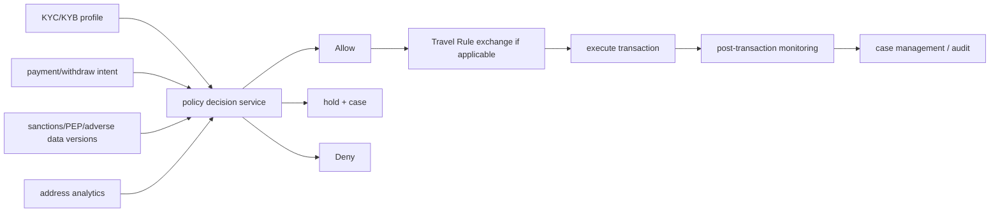

# KYC/KYB、Travel Rule 与制裁筛查架构

!!! warning "边界"
    本题是工程架构知识，不构成法律意见。适用主体、阈值、名单、数据字段、保留期和生效日期因司法辖区、牌照、产品和交易路径而异，必须由法律/合规团队确认并版本化。

## 30 秒版（开场）

> 合规系统不是“接一个 KYC API”。KYC/KYB 建立客户、企业和受益所有人身份；制裁筛查判断客户、对手方、地址和地理风险；交易监控发现行为模式；Travel Rule 在适用的虚拟资产转移中交换并保留 originator/beneficiary 信息。工程上要把政策做成版本化 decision service，交易前同步 hold/deny，交易后异步监控与 case management，并保存名单版本、输入证据、决策、人工覆盖和审计链。

## 3 分钟版（精讲深度）

1. **Onboarding**：身份采集、文档/活体、企业注册、UBO、风险评级和周期复审。
2. **Pre-transaction**：客户/对手方/地址/国家与资产策略，命中后 hold 或 deny。
3. **Travel Rule**：判断交易双方/VASP 与本地阈值，安全交换所需信息，处理不兼容和缺失。
4. **Post-transaction**：链上 analytics + 行为规则生成 alert，case analyst 决定 SAR/STR、冻结或释放等后续。

## 10 分钟版（原理 + 图示）

**不要硬编码一个“全球阈值”**

FATF 为成员提供标准和风险框架，各司法辖区落地不同。FATF 2025 年修订 Recommendation 16，并说明相关变化计划在 2030 年底前生效；产品必须记录当前适用规则、生效区间和法律依据，而不是把新闻中的数字直接写进代码。

**筛查不是布尔函数**

- 名称匹配有别名、转写、DOB、地址和实体所有权，需要 score + evidence。
- 链上地址风险来自来源、跳数、时间和 provider 模型，不是法律事实本身。
- false positive 需要 case workflow；false negative 需要回溯重筛。
- 名单更新后要对存量客户和适用历史交易 batch rescreen。

**隐私与安全**

Travel Rule/KYC 数据是高敏 PII：字段最小化、传输/静态加密、按租户/角色授权、密钥分离、访问审计、保留/删除策略和 incident response。不要把 PII 塞进链上 memo 或普通应用日志。

## 生产场景

- 名单 provider 不可用：按政策决定 fail-closed、限额或人工 hold，不能由开发临时拍脑袋。
- 地址风险分数更新：高风险 pending 提现暂停，已完成交易进入 retrospective case。
- Travel Rule 对手方不兼容：进入 hold/manual path，而不是静默丢字段后继续。
- 客户复审过期：限制高风险能力并通知补件。

## 排查与工具

每次 decision 保存 policy version、list/provider data version、input hash、result、reason codes、latency、人工 reviewer 和 override。指标监控命中率、误报率、case aging、provider error、rescreen backlog 和被 hold 资金。

## 架构取舍

同步控制降低违规风险但增加支付延迟和外部 provider 依赖；可通过本地缓存签名名单、双 provider、超时和明确降级矩阵提升可用性。降级决策属于合规政策，不是纯 SRE 参数。

## 深挖问答

1. **KYC 与 KYB？** → KYC 面向个人，KYB 面向企业并通常包含 UBO/控制人验证。
2. **Travel Rule 是否把信息写链上？** → 通常不是；信息通过适当的链下安全机制在相关机构间交换/保存。
3. **链上 analytics 能自动定罪吗？** → 不能；它是风险信号，需要政策、证据和人工 case。
4. **名单服务挂了怎么办？** → 执行预先批准的 fail/hold/limit 策略并审计，不能默认放行。
5. **如何支持规则变化？** → effective-dated policy、shadow evaluation、回放、审批和可解释 reason code。

## 反模式与事故

- 合规阈值散落在业务代码，法规/牌照变化无法追踪。
- 只在注册时筛一次，名单更新后不复筛。
- 把完整证件、Travel Rule payload 打入日志和分析平台。
- 用单一地址风险分数自动永久冻结，无 case/申诉/证据流程。

## 延伸阅读

- [FATF Virtual Assets](https://www.fatf-gafi.org/en/topics/virtual-assets.html)
- [FATF Recommendation 16 update](https://www.fatf-gafi.org/en/publications/Fatfrecommendations/update-Recommendation-16-payment-transparency-june-2025.html)
- [OFAC Virtual Currency Guidance](https://ofac.treasury.gov/system/files/126/virtual_currency_guidance_brochure.pdf)
- [OFAC FAQ 560](https://ofac.treasury.gov/faqs/560)

