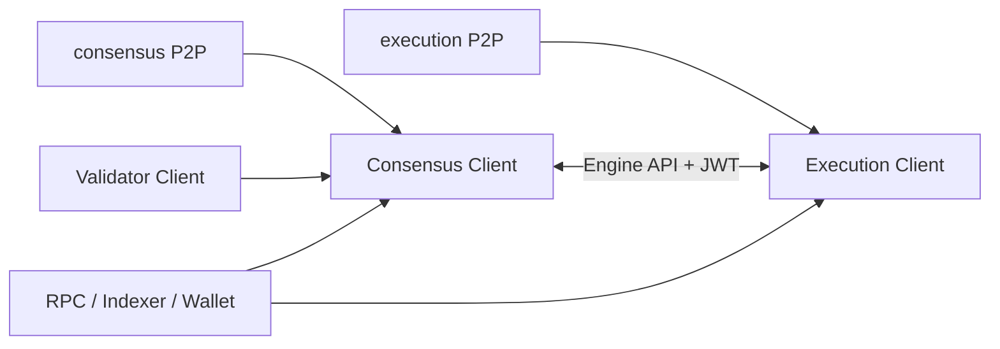

# Ethereum EL/CL、Full/Archive Node 与同步模式

## 30 秒版（开场）

> 现代 Ethereum 节点需要 execution client 和 consensus client：EL 执行 EVM、维护交易与状态并提供多数 JSON-RPC，CL 跟踪 PoS 共识和 finalized head；validator 是连接 CL 的可选职责组件。Full node 验证链并维护当前/近期状态，archive node 额外保留每个历史区块对应的状态，主要服务历史 `eth_call`、余额/存储查询和分析。Sync mode、pruning、历史保留与磁盘规模是 client-specific，不能背一个永久固定数字。

## 3 分钟版（精讲深度）

1. **EL/CL 协作**：通过受认证的 Engine API 交换 execution payload 与 forkchoice；两者任一不同步都会影响节点可用性。
2. **Full vs archive**：full node 通常仍保留历史 blocks/transactions；archive 的关键增量是历史 state 快速可查。
3. **Light client**：验证较小的共识/状态证明，能力与信任模型不同，不是“删掉数据的 full node”。
4. **Sync**：snap/full/checkpoint 等术语和实现按 client 不同；选择要从 RPC 需求、恢复时间和硬件推导。

## 10 分钟版（原理 + 图示）

**查询需求决定节点类型**

| 需求 | 通常需要 |
|------|----------|
| 当前余额、发交易、最新合约调用 | 同步健康的 full EL+CL |
| 历史 block/tx/receipt/log | full node 能力与保留配置通常足够，需验证 client |
| 任意旧高度的 account/storage/`eth_call` | archive/historical state 服务 |
| traces/state diffs | client-specific tracing + 历史状态/重放能力 |
| validator duties | EL + CL + validator/remote signer，且有 slashing protection |

不要说“查旧日志一定要 archive”。Logs/receipts 与历史 state 是不同数据；是否可查取决于 client 和 pruning/history 配置。

**同步健康不只看 block number**

- EL head、CL head、safe/finalized 是否推进。
- EL 与 CL 是否互相 connected，forkchoice 是否一致。
- peer、checkpoint/weak subjectivity、时间同步和磁盘 I/O。
- RPC 返回 `latest` 可能仍落后公共网络。

## 生产场景

- Wallet RPC：两组不同 client/provider，读 current state，不一定需要 archive。
- Indexer：实时 full nodes + 独立 backfill/archive/trace pool。
- Debug 平台：按方法路由 archive/trace client，避免重查询拖慢交易广播节点。

## 排查与工具

比较本节点 EL/CL head、safe/finalized hash 与多个可信源；检查 Engine API auth、client logs、peer、disk latency/free space、NTP。只做 HTTP `/health` 不能证明节点在正确 canonical chain 上。

## 架构取舍

自建节点提高可验证性、隐私和方法控制，但带来升级、磁盘和 on-call；第三方 provider 上手快但有配额、方法差异和共同故障域。生产通常采用自建 + 多 provider 的分层。

## 深挖问答

1. **EL 和 CL 谁提供交易执行？** → EL；CL 决定 PoS 共识/forkchoice/finality。
2. **CL 不带 validator 能运行吗？** → 可以跟踪共识；validator 是参与提议/证明的可选组件。
3. **Full node 能查历史 tx 吗？** → 通常保存历史链数据；历史状态查询才是 archive 的核心区别，仍要看 client 配置。
4. **snap sync 是否不验证历史？** → 它从可信可验证的状态同步并继续验证；具体算法看 client，不能等同“信任 provider 的数据库”。
5. **archive 必须多大磁盘？** → 依 client、版本和配置变化，查当前官方要求并做增长容量规划。

## 反模式与事故

- 只监控进程存活和 `eth_blockNumber`。
- EL 升级、CL 未升级，fork 时节点停止跟随。
- 公共 RPC/trace 与广播共用一个 archive 节点，重查询拖垮核心写路径。
- 把 client-specific sync/pruning 参数当 Ethereum 协议常量。

## 延伸阅读

- [Nodes and clients](https://ethereum.org/developers/docs/nodes-and-clients/)
- [Node architecture](https://ethereum.org/developers/docs/nodes-and-clients/node-architecture/)
- [Archive nodes](https://ethereum.org/developers/docs/nodes-and-clients/archive-nodes/)
- [Geth sync modes](https://geth.ethereum.org/docs/fundamentals/sync-modes)

