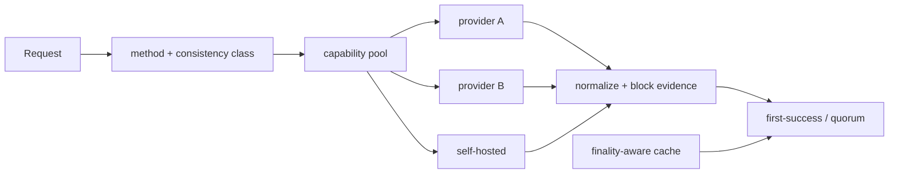

# RPC 高可用：多 Provider、Quorum、Hedging 与缓存

## 30 秒版（开场）

> 多 RPC 轮询不等于高可用。先按 method capability、archive/trace、head/finality 和配额给
> endpoint 分池；健康检查要验证 chain ID、head hash/lag 和代表性方法。确定性只读可
> retry/hedge，第一条成功不一定正确；高价值读可按同一 block hash 做 quorum，但 quorum
> 只是分歧检测，不会创造链上共识或 finality。广播只重复发送同一 raw tx，不能 hedge 两次
> “构造+签名”。缓存必须 finality-aware：按 block hash 且达到声明安全水位的结果可长缓存，
> `latest` 和 pending 只能短缓存或不缓存。

## 3 分钟版（精讲深度）

1. **方法分类**：immutable read、head-dependent read、mempool/write、subscription、archive/trace。
2. **路由**：endpoint capability + health + rate budget + region/client diversity。
3. **Hedging**：首请求超过分位延迟后再发第二个，首个成功返回并取消其余；只用于安全幂等读。
4. **Quorum**：统一请求 block reference，比较 hash/normalized result；分歧时 fail closed 或降级。

## 10 分钟版（原理 + 图示）



**读取一致性级别**

| 类别 | 示例 | 策略 |
|------|------|------|
| immutable | block by hash、在声明共识假设下 finalized 的 receipt | retry、hedge、长缓存并保留证据 |
| canonical by height | block N | 比较 hash，reorg 前可能变化 |
| head-dependent | balance at latest、gas estimate | 返回 endpoint/head evidence，短缓存 |
| pending/mempool | pending nonce、txpool | sticky/主 endpoint，结果天然局部 |
| write | send raw tx | 同 raw bytes 多播可幂等，记录每个响应 |

Quorum 不能直接比较 JSON 字符串：字段顺序、缺省值和 provider 扩展可能不同。先按协议语义 normalize，并绑定 chain ID、block hash/slot 和 commitment。
即使多个 endpoint 一致，它们也可能共享同一上游、同一 client bug 或同一陈旧快照；多数结果
不能替代轻客户端/共识证明，也不能把概率确认升级成确定 finality。

**Hedging 代价**

Hedge 能削尾延迟，也会增加请求量并可能同时触发 provider 限流。delay 应来自近期 latency 分布，并设全局预算；第一请求快速失败时可立即尝试下一个。

**缓存**

- key 包含 chain/network、method、normalized params、block reference 和 capability/version。
- `latest` 结果不能在 head 变化后继续冒充新状态。
- error/empty negative cache 要短且分类型，RPC 暂时失败不能缓存成“链上不存在”。

## 生产场景

- 提现前余额/nonce：同一 sender 的 pending 视图尽量 sticky，最终由 transaction manager 持久化 reservation。
- 充值确认：按 tx/block hash 从多源验证 canonical/finality。
- trace：独立重资源池、并发限额和长 timeout，不与普通 RPC 共用。

## 排查与工具

每次响应记录 endpoint、latency、chain/head/finalized hash、cache status、hedge/quorum decision 和 normalized error。监控 provider disagreement、lag、429、method-specific success 与成本。

## 架构取舍

多 provider 提高可用性，但若都依赖同一上游或同一 client bug，会相关失败。自建节点、不同 client/region/provider 的多样性更有价值；quorum 也增加延迟和费用，应按资金风险分级使用。

## 深挖问答

1. **第一条成功为何可能错？** → endpoint 可能落后、在不同 fork、返回缓存或方法语义不同。
2. **写请求能 hedge 吗？** → 只能安全重复同一 raw tx；不能并发生成不同 nonce/payload。
3. **pending nonce 能 quorum 吗？** → 各节点 mempool 不同，简单多数无统一真相；以本地 reservation 为主并做链上恢复。
4. **何时长缓存？** → 结果绑定 finalized/不可变 block hash 且方法语义确定时。
5. **quorum 分歧怎么办？** → 保存证据、切换/隔离异常 endpoint，高价值路径 fail closed。
6. **三家 provider 一致是否等于链已 finalized？** → 否；它只说明这些观察源当前一致，
   finality 仍来自目标链共识/协议证据。

## 反模式与事故

- 只用 `eth_chainId` 做健康检查，节点其实落后数千块。
- 对 `eth_sendTransaction` 自动重试并重新签名。
- `latest` balance 缓存几分钟，用户看到过期可用余额。
- Quorum 比较原始 JSON，因格式差异误判。

## 代码示例

见 [pool.go](https://github.com/twodog-tt/Golang-development-manual/blob/master/examples/senior/rpcpool/pool.go)：

```bash
go test -race ./examples/senior/rpcpool/...
```

## 延伸阅读

- [Ethereum JSON-RPC](https://ethereum.org/developers/docs/apis/json-rpc/)
- [Geth JSON-RPC server](https://geth.ethereum.org/docs/interacting-with-geth/rpc)
