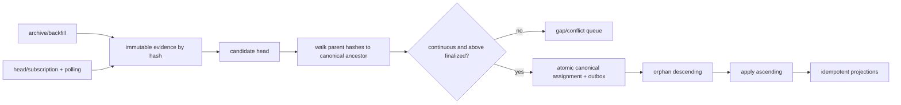

# Canonical Backfill + Realtime Merge 与 Reorg 提交协议

## 30 秒版（开场）

> Backfill 和 realtime 不能按 block number 最后写入者覆盖，而要把不可变 observation 与可变
> canonical assignment 分离。每个块按 `chain_id + block_hash` 保留 parent lineage 和
> source；候选 head 必须先由链特有 fork-choice/canonical 证据选出，再证明能沿 parent hash
> 连续走到当前 canonical 祖先。父链连续只是必要条件，不会自动证明它是主链。reorg 先按高度
> 倒序发布 orphan，再按高度正序 apply 新分支；双通道在重叠区要证明双方观察到同一组
> canonical hashes，最大高度相等不代表没有洞。

## 3 分钟版（精讲深度）

核心数据模型：

- `block_observation(chain_id, hash)`：height、parent hash、payload/receipt root、provider/source、raw location，不可变。
- `canonical_assignment(chain_id, height)`：当前 hash、assignment version、finality status，可变但保留变更历史。
- `consumer_watermark`：canonical hash + height + assignment version，不能只存 number。
- `reorg_event`：common ancestor、orphaned hashes、applied hashes、reason/source evidence。

Realtime 负责低延迟提示，backfill 负责完整性；两者都只能先写 evidence，再由单一 canonicalizer 改 ownership。

## 10 分钟版（合并算法）



### Adopt 的安全步骤

1. 读取候选 `head_hash` 对应 evidence，不能从“高度最新”反推 hash。
2. 沿 `parent_hash` 向后走；每一步验证 `parent.height + 1 == child.height`。
3. 遇到当前 canonical 同 hash 的块，得到 common ancestor。
4. 若路径缺 parent，进入 gap recovery；不能跳过后直接 adopt。
5. 使用链特有 fork choice、共识证明或受信任 canonical source 判断候选权威性；不能只选高度
   最大、工作量字段最大或 provider 多数。
6. 若候选分支要替换协议 finalized checkpoint 或更低历史，fail closed 并升级链/provider 事件。
7. 在同一数据库事务内更新 canonical assignments、assignment version 和 outbox。
8. consumer 按 orphan descending 回滚派生状态，再按 applied ascending 重放。

必须分开保存两个水位：

- **protocol finality checkpoint**：例如 Ethereum `finalized` 或 BFT commit，来自协议证据；
- **credit/risk watermark**：例如 PoW 的 N confirmations、金额分层或运营策略，只表示业务接受的
  概率风险，不应命名为 protocol finality。

两者都不能被一个全链固定 N 抽象掉。若协议发生真正的 finality violation，应进入人工/安全
事件流程；若只是业务阈值内的概率 reorg，则按已声明的冲正和风险流程处理。

### Backfill/realtime handoff

正确 handoff 不是比较 `backfill_max_height == realtime_min_height`：

- realtime 先启动并 durable buffer；
- backfill 向前推进到超过目标交接点；
- 对 `[H-k, H]` 每个高度比较 canonical hash，并核对 tx/receipt/event count 或 root/checksum；
- gap scanner 证明区间连续，decoder/projection watermark 也赶上；
- 原子转移 range ownership，保留一段 overlap 继续审计。

两个 source 都看到高度 1000，但一个漏了 998，最大值仍相等。watermark 必须带“连续到哪里”的证明，而不是 `MAX(height)`。

### 多 provider 分歧

同高度不同 hash 是合法 evidence，不能立即以多数票删除少数分支。先验证 parent lineage、协议 finality、节点同步/chain ID 和独立来源。多数一致可作为读路径信号，但不等于共识证明；尤其不能用三个同一上游的 provider 冒充独立 quorum。

### 一致读取

跨多次 RPC 读取一个状态快照时应绑定 block hash。EIP-1898 允许支持的方法用 `blockHash`，并可用 `requireCanonical` 要求节点拒绝非 canonical block；只固定 block number 在调用间发生 reorg 时可能读到不一致状态。

## 可运行示例

```bash
go test -race ./examples/senior/chainmerge/...
```

示例证明 overlap hash 覆盖、gap fail closed、reorg rollback/replay 顺序、finalized 不可改写和 orphan evidence 保留。它是内存状态机；生产需要事务、outbox、持久化 raw evidence 和链特有 finality adapter。

## 生产场景

- WebSocket 断线后从持久化的 canonical 扫块水位回补，订阅只负责提示。
- Archive provider 限流时可暂停 backfill，不影响 realtime evidence；切勿悄悄跳过 receipt。
- Decoder bug 修复只重建 facts/projection，不改 raw block 和 canonical history。
- 深 reorg 时按受影响 asset/merchant 冻结派生可用余额，完成 reversal 与对账后恢复。

## 排查与工具

指标：source contiguous watermark、head lag、unknown parent、same-height disagreement、reorg depth、finalized conflict、orphan/apply backlog、projection assignment version、overlap mismatch。每次 handoff 保存区间、hash 清单/checksum 和参与 source 作为证据。

## 架构取舍

单 writer canonicalizer 最容易证明顺序；吞吐可按 chain/network 分片，而不能让同一 chain 的多个 writer 无 CAS 抢高度。大型 projection 可异步消费 outbox，但 canonical commit 与事件发布必须原子关联。

## 深挖问答

1. **为什么 block number 不能当主键？** → 同高度可因 reorg 有多个 hash；number 是位置，不是不可变身份。
2. **parent 缺了能先处理后补吗？** → evidence 可先缓冲，canonical/projection 不能越洞提交。
3. **怎样确认 backfill 已追上？** → 连续区间 + canonical hash overlap + 内容对账，不是比较最大高度。
4. **reorg 为什么先 orphan 倒序？** → 先撤销子状态再撤父状态，随后新分支从祖先正序重放。
5. **finalized 冲突怎么办？** → 视作协议/provider/配置安全事件，停止自动覆盖并保全证据。
6. **parent lineage 连续是否足以选主链？** → 否；多个合法分支都可能连续，仍需链特有
   fork choice、共识证明或 canonical authority。

## 反模式与事故

- `UPSERT blocks ON CONFLICT(height) DO UPDATE`，把旧分支证据覆盖掉。
- Backfill 跑完后才启动 realtime，交接窗口丢块。
- 仅保存 `last_processed_height`，重启时不知道该高度 hash 是否仍 canonical。
- 多 provider 取多数后直接入账，未验证它们是否同一上游或同步落后。
- consumer 只处理 added event，不支持 orphan/reversal。

## 延伸阅读

- [EIP-1898 block-hash state queries](https://eips.ethereum.org/EIPS/eip-1898)
- [S-NODE-04 链上数据平台](./S-NODE-04-chain-data-platform.md)
- [S-BC-05 Indexer Reorg](../12-blockchain-web3/S-BC-05-indexer-reorg.md)
