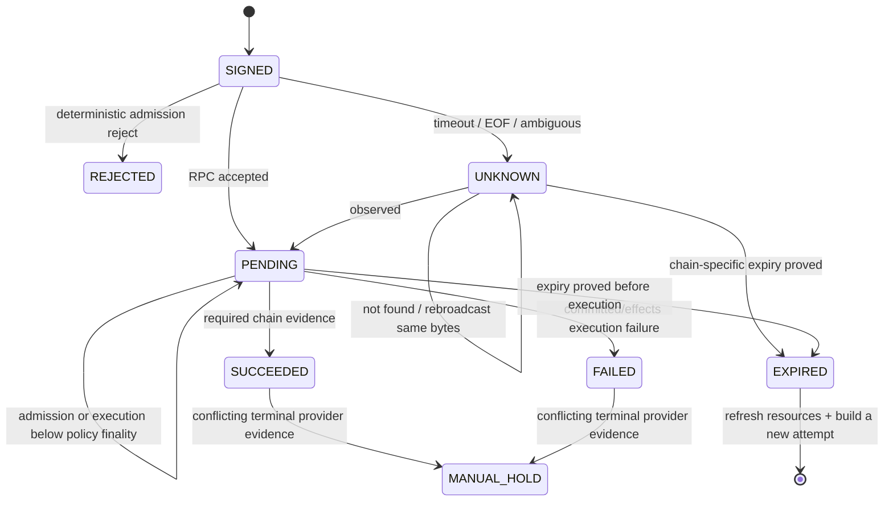

# 非 EVM 在线 SDK：提交、确认、故障注入与升级兼容

## 30 秒版（开场）

> 非 EVM 在线集成必须保留每条链自己的提交、执行、最终性和资源失效语义。Solana `sendTransaction` 成功只表示 RPC 接受，仍要查 status/commitment 与 blockhash expiry；Cosmos `sync` 只等 CheckTx，不能当成已进块执行；Aptos 要区分 pending 与 committed 的 `success/vm_status`；Sui 以 transaction effects 判断执行，checkpoint 是可选的索引/证据边界而不是所有业务的协议最终性前提。所有链在广播超时或暂时 `not found` 时都先进入 UNKNOWN，查询或重播同一 signed bytes；成功与失败使用对称的最终性门槛，只有证明过期并重读 sequence/blockhash/object 等资源后才能重建。若“已证明过期”后又出现入链证据，应冻结调查重复副作用风险。

## 3 分钟版（精讲深度）

统一 adapter 只能统一 orchestration contract，不能抹平语义：

| 链 | RPC 接受不代表 | 成功证据 | 重建前必须重读 |
|----|---------------|----------|----------------|
| Solana | processed/confirmed | 无 execution error 且达到业务 commitment | recent blockhash/last valid block height 或 durable nonce、fee/account state |
| Cosmos | CheckTx 通过不代表 DeliverTx/commit 成功 | committed tx result/code 与目标 chain 语义 | chain capability、account number/sequence 或 unordered tx 条件、gas/fee |
| Aptos | submit 返回 hash 不代表 committed success | committed transaction + `success`/`vm_status` | ledger time、sequence 或 orderless capability、gas/chain ID |
| Sui | provider 返回 digest 不代表 effects 成功 | 经验证的 effects；按业务选择是否等待 checkpoint | protocol/API capability、object refs 或 address balance、gas mode |

`tx_hash` 应在提交前从 exact signed bytes 得到并持久化；若 SDK/协议允许。状态机永远跟踪“同一 bytes 的同一 digest”，不能在重试中悄悄换交易。

## 10 分钟版（在线测试与故障状态机）



### Solana

官方 `sendTransaction` 文档明确：RPC 收到后立即返回 first signature，不等待确认，成功响应不保证集群已处理或确认；应继续查询 `getSignatureStatuses`。生产还要：

- 保存 blockhash 与 `lastValidBlockHeight`，不要用“等 60 秒”猜过期；
- preflight commitment 与后续读取 commitment 明确一致，记录 `minContextSlot`/context；
- `not found` 可能是节点历史、索引延迟或未落地，不等于交易从未传播；
- 未过期可向其他节点重播**同一 base64 bytes**，不要换 blockhash 后并发签第二笔；
- durable nonce 是不同生命周期，必须跟踪 nonce account 状态。

### Cosmos SDK / CometBFT

当前 Cosmos SDK 文档中 `sync` 只等待 CheckTx，`async` 更早返回。`CheckTx code=0` 只是
`PENDING`，非零是预执行准入 `REJECTED`，两者都不是 committed execution 的成功或失败；
入块后仍要按 tx hash 查询 committed result。还要做链能力发现：Cosmos SDK v0.53 起支持由
具体链选择启用 unordered transactions；启用时 sequence 规则和 timeout timestamp 与传统
有序账户不同，不能继续讲解“所有 Cosmos 交易永远 sequence++”。

执行失败后是否消耗 sequence、fee 以及在哪个 AnteHandler 阶段失败，需按目标链/版本验证并重读账户；不要从错误文本硬编码推断。

### Aptos

Aptos 官方提供 Go SDK。在线 adapter 应把 build/simulate/sign/submit/wait 拆开，保存 BCS 与 hash，直到返回 committed transaction 再检查 `success` 和 `vm_status`。timeout/not-found 不应直接将 sequence 加一重签；先查当前 ledger version/time、交易 hash 与账户资源。Orderless、sponsored、multi-agent 等能力也要按 SDK/网络版本显式建模。

### Sui

成功 effects 与 checkpoint 要区分。Sui 官方系统资料说明 effects 的 finality/settlement 可在 checkpoint 形成前完成；checkpoint 更适合作为 durable indexing、批量证明或业务证据水位，是否等待由产品风险定义，不能说“未进 checkpoint 就一定没最终”。

同时要处理快速 API 演进：**截至 2026-07-17，Sui 官方文档已标记 JSON-RPC deprecated，要求迁移 gRPC 或 GraphQL，并公告公共 Testnet endpoint 在 7 月 6 日当周、Mainnet 在 7 月 20 日当周关闭。** 这是一条有日期的迁移事实，adapter 应 capability probe，而不是永久硬编码某传输。

## 测试分层

1. **离线 golden vector**：固定 SDK/toolchain，验证 sign bytes、domain、hash、序列化与官方 CLI/reference implementation 一致。
2. **deterministic RPC contract test**：fake/recorded server 注入 timeout、malformed response、lag、rate limit 和 provider disagreement。
3. **localnet integration**：真实节点执行 success、VM/program failure、expiry、sequence/object conflict 和升级迁移。
4. **scheduled testnet smoke**：opt-in、极小额度、独立账户与预算，记录 genesis/chain ID、node/API/protocol/SDK version；不放在每次 PR 的确定性门禁。
5. **mainnet read-only/shadow**：升级前比较旧新 adapter；写路径先 canary 与硬限额。

Public testnet 不是稳定 CI：faucet、网络、provider 和协议都可能变化。失败要分类为产品回归、环境不可用或 capability 变化。

## 可运行故障注入

```bash
go test -race ./examples/senior/txlifecycle/...
```

`txlifecycle` 验证 UNKNOWN、不因 `not found` 重建、成功/失败使用对称终态门槛、CheckTx/执行分离、Sui effects/checkpoint 策略、未观察执行时的过期重建，以及“低最终性执行后又过期”或 terminal provider 分歧进入 manual hold。它仍是 orchestration contract；四个独立 module 负责真实 endpoint 的 wire contract、链身份和原始 evidence。

离线交易向量与 endpoint contract test 分别执行：

```bash
(cd examples/non-evm-sdk/solana && go test ./...)
(cd examples/non-evm-sdk/cosmos && GOMAXPROCS=2 go test -p=1 ./...)
(cd examples/non-evm-sdk/aptos && go test ./...)
(cd examples/non-evm-sdk/sui && go test ./...)
```

这些测试用本地 fake server 固定 method/path/body 和
unknown/pending/rejected/success/failure/expired 解析，因此可作为 PR
门禁；各 module 的外网 smoke 只有设置对应 endpoint 环境变量才运行。广播还要求单独提供已经
签名的交易环境变量，不能因为配置了 RPC URL 就自动领水或花费测试币。readiness 必须返回并由
调用方校验 genesis/chain ID；HTTP 200 或节点不在同步都不能证明连到了目标网络。

`examples/non-evm-sdk/localnet/` 在这之上增加生产兼容门禁：

- manifest 同时固定 node N/N-1 的 official source tag、commit 和 binary；
- fixture tests 回放两版 readiness/transaction response，并对 breaking type/enum
  fail closed；fixture 是最小 contract evidence，不冒充真实节点；
- opt-in localnet gate 对真实节点执行 readiness、链身份 pin 和未观察交易查询；
- Toxiproxy 注入 latency、timeout/reset，断言 transport failure 返回 error，`Outcome`
  保持未设置，不能伪装成 `UNKNOWN/FAILED/EXPIRED`；
- node restart 与 N→N-1/N-1→N 运行由 harness 分开执行。Solana 的跨 major 变更默认
  fresh ledger；只有厂商保证兼容的组合才允许复用状态；
- Sui 路径只验 GraphQL/gRPC 迁移后的接口边界，不增加 deprecated JSON-RPC fallback。

默认测试不下载 source、不启动节点、不广播交易；真实 localnet、源码构建和带 toxic 的测试
必须显式 opt in。当前 corpus 覆盖网络与 schema/identity 兼容，不等于已经覆盖每条链的
program/VM failure、资源冲突和带余额交易；后者需要 disposable account 与链特定 fixture，
不能用一个通用“转账成功”脚本伪造。

**截至 2026-07-17 的实跑证据边界**：已用固定二进制完成 CometBFT
`0.38.22 → 0.38.23` 状态目录复用、identity 保持、节点停启，以及 Toxiproxy
latency/timeout/reset 与故障后恢复。Solana、Aptos、Sui 已完成版本 manifest、provenance、
启动/升级 harness、N/N-1 fixture、错误 schema/identity 和离线故障门禁，但本机尚未构建
三套大型节点二进制，因此不能表述为“四条链真实 localnet 都已跑通”。Sui fresh lane 必须先
执行 `sui genesis --working-dir ...`，再用 `sui start --network.config ...`；固定版本源码
明确拒绝把 `--force-regenesis` 与 `--network.config` 同时传入。

## 生产场景

- SDK 升级同时运行 old/new builder，对同一 intent 比较 sign bytes；差异必须由协议变更解释。
- Provider A timeout、B not found：保持 UNKNOWN，重播原 bytes 并查 C；不要释放 nonce/object reservation。
- Sui JSON-RPC 迁移：gRPC 面向 full-node live path/交易执行，GraphQL 面向索引查询且也可提交交易；内部 normalized contract 保持版本化，不假设方法一一等价。
- Cosmos 链升级启用 unordered tx：先 capability probe 和 shadow，不能全生态一键切换。

## 排查与工具

每 attempt 保存 intent ID、signed bytes digest、tx hash、resource snapshot、SDK/adapter version、endpoint、request/response evidence、commitment/finality policy 和观测时间。敏感签名材料按最小化与保留策略处理。

## 架构取舍

一个统一 tracker 能减少重复状态机错误，但 chain adapter 必须拥有证据解释权。若把所有状态归一成 pending/success/failed 而不保存原始 evidence，会让升级、争议和资金对账无法恢复。

## 深挖问答

1. **提交返回 hash 是否成功？** → 只说明请求/交易被某层接受；按链查询执行结果和业务 finality。
2. **查不到交易能重签吗？** → 不能据此；先查/重播同一 bytes，只有证明原 attempt 不会执行且资源已刷新才重建。
3. **Cosmos `sync` 返回 code 0/非零呢？** → code 0 只代表 CheckTx 通过；非零是准入
   `REJECTED`，都不是已进块执行终态。
4. **Sui 一定等 checkpoint 才最终吗？** → 不是；effects 可先达到协议 finality，checkpoint 是否需要是证据/产品策略。
5. **为什么 testnet 不放普通 PR？** → 外部状态不确定；PR 用 deterministic/localnet，testnet 做定时兼容 smoke。

## 反模式与事故

- 把四条链都套成 EVM nonce + receipt + N confirmations。
- SDK `Submit` 无 error 就释放资金 reservation。
- timeout 后换 blockhash/sequence/object 立即重签，旧交易随后也落地。
- 只 pin Go module，不记录 node/API/protocol/chain upgrade version。
- 2026 年仍新建依赖 Sui deprecated JSON-RPC 公共 endpoint 的主路径。

## 延伸阅读

- [Solana sendTransaction](https://solana.com/docs/rpc/http/sendtransaction)
- [Cosmos SDK transaction broadcast](https://docs.cosmos.network/sdk/latest/node/txs)
- [Aptos Go SDK](https://aptos.dev/build/sdks/go-sdk)
- [Sui RPC migration](https://docs.sui.io/references/sui-api)
- [S-WALLET-01 Chain Adapter](../17-multichain-wallet/S-WALLET-01-chain-adapter-capability-matrix.md)
