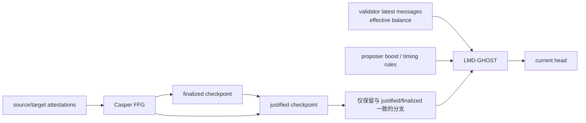

# Ethereum PoS、Fork Choice、Finality 与弱主观性

## 30 秒版（开场）

> Ethereum PoS 不是“票最多的块立即最终”。Fork choice 从 justified checkpoint
> 出发，在与 finalized checkpoint 一致的可行分支上执行 LMD-GHOST，按验证者最新
> 消息和有效余额选择 head，并包含 proposer boost 等协议规则。Casper FFG 负责
> checkpoint 的 justification/finalization：健康网络通常很快最终，但不是固定经过
> 两个 epoch 就无条件最终。长期离线或新同步节点还需要近期 weak-subjectivity
> checkpoint，避免仅凭旧验证者密钥构造的长程历史。

## 3 分钟版（精讲深度）

1. **Head 与 finality 分工**：LMD-GHOST 选择当前链头；Casper FFG 为 checkpoint
   提供经济最终性，两者不能合成一个“确认数”。
2. **LMD**：每个验证者的 latest message 只保留其最新有效投票，不能把同一验证者
   的历史投票重复累计。
3. **GHOST**：从 justified root 逐层选择累计支持权重最大的子树，而不是在所有叶子
   中直接选最高块。
4. **Finality**：达到协议阈值的 target vote 先使 checkpoint justified，再按相邻
   justified checkpoint 关系推进 finalized。
5. **弱主观性**：节点离线过久后，不能只靠 genesis 和当前网络流量安全选择历史；
   应从独立可信渠道取得足够新的 checkpoint。

## 10 分钟版（原理 + 图示）

### 四个状态不要混淆

| 状态 | 含义 | 能否变化 |
|------|------|----------|
| Head | 当前 fork choice 选出的链头 | 正常情况下可因新块、投票或短重组变化 |
| Justified checkpoint | 获得足够 target 支持的检查点 | 可能继续向前推进，不等于最终 |
| Finalized checkpoint | 按 FFG 规则完成最终化的检查点 | 冲突最终化需要破坏安全假设并产生可罚没证据 |
| EL `safe/finalized` | CL 通过 Engine API 传给 EL 的共识水位 | 语义来自共识层，不是 EL 自己数区块 |

Fork-choice 规格只考虑与已知 finalized checkpoint 不冲突的分支，并从 justified
checkpoint 执行 LMD-GHOST。讲解时说“最长链”过于粗糙；块高相同也不是简单比较块数。

### FFG 阈值的准确表达

规格按活跃验证者 **有效余额** 统计 target attestation；达到至少三分之二的条件后，
checkpoint 可以被 justified，再由 justification bits 与 source/target 关系推进
finalized。不要说：

- “三分之二节点在线就一定 finalize”——统计的是 voting power/effective balance，
  还要投给正确 source、target。
- “看到三分之二 attestation 就是最终”——justification 与 finalization 是不同步骤。
- “finalized 数学上绝不可能回滚”——它是带罚没与社会恢复边界的经济最终性；严重
  client bug、超过安全阈值的作恶或协议级干预不应被隐藏。

### 安全性与活性

- 约三分之一以上权重离线或拒绝正确投票时，链仍可能出块，但 finality 会停止。
- inactivity leak 会逐步削弱不参与者的有效余额，使剩余参与者最终重新达到阈值；
  这改善活性，但恢复时间取决于参与率和协议状态。
- 两个冲突 checkpoint 被 finalized 意味着安全假设被破坏，至少有显著权重可被问责；
  不能把这种事故当作普通短 reorg。

### 为什么需要 weak subjectivity

PoS 验证者退出并可提取资金后，历史私钥可能不再受当前罚没约束。长期离线节点若仅从
genesis 比较两条看似都合法的历史，可能无法客观排除长程攻击。因此：

1. 从客户端发行、可信运营方或多个独立渠道取得近期 checkpoint。
2. 同步时要求该 checkpoint 位于 canonical sync path。
3. 检查 checkpoint 是否仍在 weak-subjectivity period 内。

这不是“每个区块由中心化服务器指定”，而是 PoS 长期同步的额外信任锚；来源仍应多样化
并可审计。

## 生产场景

- 交易所充值按 head/safe/finalized 分层入账，大额资产不要只等待固定 N 个块。
- RPC 网关同时监控 EL head、CL head、justified/finalized 和 Engine API 连接状态。
- 节点离线超过运维策略窗口后，从批准的多源 checkpoint 重新同步，而不是盲目继续旧库。
- 监控 finality delay、参与率、client diversity、时钟偏差和 proposer/attestation 延迟。

## 排查与工具

若 head 推进但 finalized 不推进，先看参与率和 target vote，再看 CL peer、时钟、客户端
版本与网络分区。若 EL `latest` 推进但 `finalized` 不动，还要确认 EL/CL Engine API
是否健康。不要通过删除数据库或手工指定 head 来“修复”共识。

## 架构取舍

应用可以早于 finalized 提供体验，但必须把可撤销展示、风险额度和不可逆账务分层。
节点 checkpoint 来源越集中，运维越简单但信任集中度越高；生产应维护来源清单、签名/
哈希证据和交叉验证。

## 深挖问答

1. **LMD-GHOST 的 LMD 是什么？** → 每个验证者只按最新有效消息计权，避免历史票重复累计。
2. **Head 为什么能在 finalized 不变时重组？** → fork choice 在 finalized 之后仍持续选择最优分支。
3. **三分之一离线会怎样？** → 可能继续出块但停止最终化，之后由恢复参与率或 inactivity leak 恢复。
4. **弱主观 checkpoint 是不是信任单一网站？** → 不应如此；应来自独立、可验证、受治理的多源渠道。
5. **最终化后能否普通回滚？** → 不能作为日常运维动作；冲突处理属于协议和社会协调事件。

## 反模式与事故

- 把 Ethereum PoS 描述为“最长链 + 12 个确认”。
- 把 attestation、justification、finalization 混成一个状态。
- 节点离线数月后仍无 checkpoint 地从旧状态直接追链。
- 只看 EL block number，不监控 CL finality delay。
- 宣称 finalized 代表任何上层桥、Rollup 提现也已经完成。

## 延伸阅读

- [Beacon Chain fork choice specification](https://github.com/ethereum/consensus-specs/blob/master/specs/phase0/fork-choice.md)
- [Beacon Chain justification and finalization](https://github.com/ethereum/consensus-specs/blob/master/specs/phase0/beacon-chain.md)
- [Weak subjectivity specification](https://github.com/ethereum/consensus-specs/blob/master/specs/phase0/weak-subjectivity.md)
- [S-PROTO-05 经典共识 vs 链上共识](./S-PROTO-05-classic-vs-onchain-consensus.md)
- [S-NODE-01 Ethereum EL/CL 与同步](../19-node-rpc-staking/S-NODE-01-ethereum-node-architecture-sync.md)
