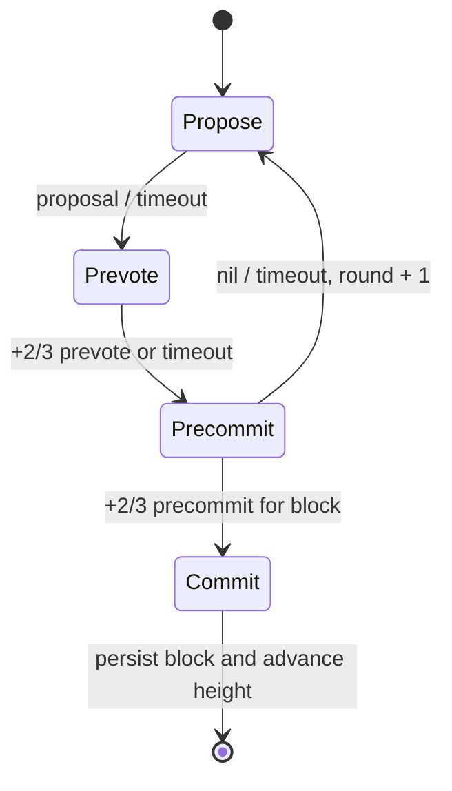

# BFT / CometBFT：轮次、锁、安全性与活性

## 30 秒版（开场）

> CometBFT 在每个高度运行一个或多个 round，每轮经历 Propose、Prevote、
> Precommit；看到某个块在同一高度与轮次获得超过三分之二 voting power 的
> precommit 才进入 commit。本地验证者在 Precommit 步骤观察到同轮某块的
> `+2/3 prevote`（PoLC）后才锁定/重锁并 precommit；更高轮的合法 PoLC 可支持安全
> 换锁，不能说成“网络一出现 prevote 就让所有人同时锁定”。假设 Byzantine voting power 小于三分之一并最终
> 进入同步期，可以同时讨论安全性和活性；三分之一及以上即使不双签，也能通过不投票
> 阻止链前进。

## 3 分钟版（精讲深度）

1. **高度与轮次**：同一个 height 可能经历多个 round；proposer 离线、块无效或消息
   延迟都会触发超时并进入下一轮。
2. **Prevote**：验证者对有效 proposal、已锁定块或 `nil` 投 prevote。
3. **Precommit**：同轮某块获得 `+2/3 prevote` 后验证者锁定该块并 precommit；
   未形成相应证明时通常 precommit `nil`。
4. **Commit**：某块获得同一 `(height, round)` 的 `+2/3 precommit`。
5. **换锁**：只在观察到更高轮次的合法 PoLC 时换锁，兼顾安全与跨轮活性。

这里的 `+2/3` 是 **严格超过三分之二 voting power**，不是“节点数量大概三分之二”。

## 10 分钟版（原理 + 图示）

### 投票类型不能混

| 观察 | 能推出什么 | 不能推出什么 |
|------|------------|--------------|
| `+2/3 prevote(B, H, R)` | 形成 PoLC，验证者可锁定/换锁并 precommit B | 所有人已经 commit B |
| `+2/3 prevote(nil)` | 本轮没有块形成可锁定多数，推进 precommit/下一轮 | 链永久停止 |
| `+2/3 precommit(B, H, R)` | 可构造该高度的 commit | 下一高度应用状态已经落盘 |
| 本地看到少量 precommit | 只是局部网络观察 | “多数验证者已经同意” |

### Lock 为什么保证安全

如果块 B 已获得 `+2/3 precommit`，其中至少有 `1/3+` voting power 在小于三分之一
Byzantine 的假设下是诚实且受锁规则约束的。它们不会无证明地改投冲突块；要在更高轮
换锁，需要看到更高轮次的 `+2/3 prevote`。若没有足够验证者双签或违反锁规则，冲突块
无法再取得 `+2/3 precommit`。

讲解时不要把 lock 说成“节点永远不能改票”。它是带 round 条件的协议状态；安全换锁
正是网络从不同轮锁定状态恢复活性的关键。

### Safety 与 Liveness 分开回答

- **Safety**：在 Byzantine voting power 小于三分之一、签名和状态机规则正确等假设下，
  不会 commit 两个冲突块。
- **Liveness**：还需要网络在未知时间后进入足够同步的阶段、正确 proposer 最终出现、
  timeout 能覆盖消息传播和足够 voting power 在线。
- **1/3+ 阻断**：恶意或离线联盟不需要制造另一个 commit，只要拒绝投票就可以使链停止。
- **超过阈值作恶**：出现冲突 commit 后，问题已超出自动 BFT 协议的正常恢复边界，需要
  证据、治理和外部协调。

### 和 Ethereum PoS 的区别

CometBFT 通常在每个高度通过多轮投票形成单块 commit，提供快速确定性；Ethereum
则持续运行链式 fork choice，并用 epoch checkpoint 做 FFG finality。两者都使用权益
权重和 Byzantine 阈值，但状态机、消息和 finality 水位不能互换。

## 生产场景

- remote signer/slashing protection 必须单调持久化 chain 与最后签名的
  `(height, round, signed message type/step)`。该元组是拒绝倒退/同类型重复签名的
  顺序护栏；为支持同请求幂等返回并检测同 H/R/type 的冲突，还应持久化 canonical
  sign bytes（含 BlockID/nil 等语义）及原签名，不能仅保存一个 tuple 后重新签。
- validator key 的主备切换不能只依赖进程锁；需要 fencing、单活租约和签名历史。
- 监控 round 增长、proposal/prevote/precommit timeout、voting power participation、
  peer 拓扑与共识 reactor backlog。
- 应用 `FinalizeBlock/Commit` 超时、磁盘 fsync 或确定性 bug 也会让诚实节点无法参与投票。

## 排查与工具

链停在同一 height 时，比较多节点的 `(H,R,S)`、proposal block ID、prevote/precommit
分布和 validator power。若不断升 round，判断是 proposer、块传播、应用验证还是网络
延迟。只看“节点在线数量”不够，必须看在线 voting power。

## 架构取舍

更短 timeout 可降低健康网络延迟，但在跨地域和抖动下增加空轮；更长 timeout 提高稳定性
却拉长故障恢复。validator set 越集中，网络通信和运维更简单，但故障域、审查和密钥风险
更集中。

## 深挖问答

1. **为什么有 prevote 还要 precommit？** → 前者形成锁定证明，后者才表达在锁规则下的提交承诺。
2. **锁住后为何还能换锁？** → 观察到更高轮合法 PoLC 时换锁，避免不同轮锁导致永久停滞。
3. **三分之一恶意能分叉吗？** → 在假设内通常不能形成两个 commit，但能阻止 `+2/3`、造成停链。
4. **节点数 70% 在线是否足够？** → 取决于在线节点对应的 voting power，不按节点个数。
5. **commit 后应用一定完成了吗？** → 还要区分本地观察 commit、收到块、执行状态机和持久化完成。

## 反模式与事故

- 说“收到 2/3 投票就最终”，不说明 prevote/precommit、height、round。
- 双机同时加载同一 validator key，认为共识层会自动去重。
- 把网络异步阶段的超时换轮误判成安全性失效。
- 只统计 validator 数量，不统计 voting power。
- 为追求低延迟把 timeout 固定得过小，导致跨地域持续空轮。

## 延伸阅读

- [CometBFT consensus specification](https://github.com/cometbft/cometbft/blob/main/spec/consensus/consensus.md)
- [CometBFT Byzantine consensus algorithm](https://docs.cosmos.network/cometbft/latest/spec/consensus/Byzantine-Consensus-Algorithm)
- [CometBFT validator signing rules](https://docs.cosmos.network/cometbft/latest/spec/consensus/Validator-Signing)
- [S-PROTO-05 经典共识 vs 链上共识](./S-PROTO-05-classic-vs-onchain-consensus.md)
- [S-WALLET-04 Cosmos、CometBFT 与 IBC](../17-multichain-wallet/S-WALLET-04-cosmos-cometbft-ibc-sequence.md)
- [S-PROTO-01 Ethereum PoS 与 Fork Choice](./S-PROTO-01-ethereum-pos-fork-choice-finality.md)
