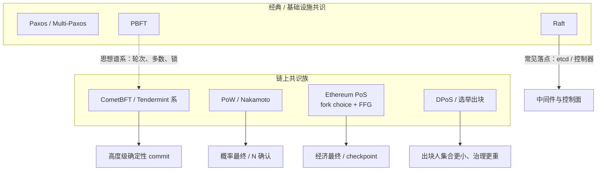

# 经典共识 vs 链上共识：Paxos/Raft/PBFT 与 PoW/PoS/DPoS/BFT

## 30 秒版（开场）

> 经典共识（Paxos / Raft / PBFT）解决**已知成员、可运维替换**的复制与故障；链上共识
> （PoW / PoS / DPoS / 链上 BFT）还要处理**开放或可替换验证者、经济激励、分叉选择与
> 最终性语义**。etcd 的 Raft 线性一致、Bitcoin 的 N 确认、Ethereum 的 finalized、
> CometBFT 的 height commit **不是同一水位**；业务入账必须按链的最终性模型分层，不能
> 把中间件共识词直接套到链上确认。

## 3 分钟版（精讲深度）

1. **成员模型**：经典共识通常是封闭集群（配置变更走成员变更协议）；公链验证者集合可
   进出，权重常按算力或权益，长期安全还可能依赖弱主观性等额外锚点。
2. **故障模型**：Raft / Multi-Paxos 主流实现面向崩溃故障（CFT）；PBFT 与多数公链共识
   面向拜占庭故障（BFT）。CFT 结论不能直接当成 BFT 安全证明。
3. **输出语义**：经典共识输出「某个 log index 已提交」；Nakamoto 系输出「当前最重/
   最长链上的概率最终」；Ethereum PoS 区分 head / justified / finalized；CometBFT
   在每个高度多轮投票后 commit 单块。
4. **名字相近不等于同一算法**：DPoS 是「选举出块人」的治理/出块组织方式；Ethereum
   PoS 是 fork choice + FFG；CometBFT 是按高度的 BFT 状态机——三者都谈 stake，状态机
   不可互换。

## 10 分钟版（原理 + 图示）

### 一张总表：先对齐问题再谈算法

| 维度 | Paxos / Raft | PBFT | PoW | Ethereum PoS | DPoS（典型） | CometBFT |
|------|--------------|------|-----|--------------|--------------|----------|
| 典型场景 | 配置中心、元数据、DB 复制协调 | 许可链、封闭 BFT 集群 | BTC 等开放挖矿 | 以太坊主网 | 选举超级节点出块 | Cosmos 系等 |
| 成员 | 已知、可配置变更 | 已知、常许可 | 开放算力 | 开放质押进出 | 选民→代表 | 已知 validator set（可治理变更） |
| 故障假设 | 多为崩溃（CFT） | 拜占庭 | 拜占庭 + 算力博弈 | 拜占庭 + 经济惩罚 | 拜占庭 + 治理/选举 | 拜占庭（voting power 小于 1/3） |
| 「达成一致」长什么样 | log 条目提交 | 请求在视图内提交 | 最长/最重链领先 | head 可重组；finalized 难撤销 | 由当选出块人推进；最终性因链而异 | 某 `(height,round)` 的 `+2/3 precommit` |
| 通信量量级直觉 | 通常更低 | 经典实现偏二次 | 传播块/头即可 | 大规模 attestation 聚合 | 代表集合小则通信轻 | 验证者间多轮投票 |
| 业务误用 | 以为「写进 etcd 就等于链上确认」 | 以为公链都是 PBFT | 固定 N 确认当绝对最终 | 把 head 当 finalized | 把 DPoS 说成「就是以太坊 PoS」 | 把 prevote 当 commit |

### 经典共识各自解决什么

**Paxos**  
提出「多数派接受」下的一致性框架；工程上多用 Multi-Paxos / 变体。重点是**提议编号、
承诺与多数接受**，不是「选一个领导然后大家听他的」这一句口诀。

**Raft**  
把一致性拆成 leader 选举、日志复制、安全性约束，强调可理解与可实现。适合**封闭、
可运维**的复制状态机（etcd、许多控制器）。Leader 故障走选举超时；**不能**据此声称
「公链出块人也是 Raft leader」。

**PBFT**  
面向拜占庭节点的经典三阶段（pre-prepare / prepare / commit）与视图变更。给后续
Tendermint / CometBFT 等提供了「轮次 + 多数 + 锁定」的谱系直觉，但**具体消息名、
锁规则、proposer 选择与 Cosmos 应用边界以 CometBFT 规格为准**，不要背 PBFT 论文
直接当生产链行为。

### 链上共识各自解决什么

**PoW（Nakamoto）**  
用算力竞争出块，分叉时跟最重/最长工作量证明链。确认是**概率性的**：后面叠的越多，
被重组的成本越高，但没有「某高度数学上不可逆」的封闭集群式 commit。业务常用
「N confirmations」是**风险预算**，不是共识层发来的 finalized 事件。

**PoS（以 Ethereum 为代表）**  
验证者以质押权重投票。Ethereum 把 **LMD-GHOST fork choice（选 head）** 与
**Casper FFG（justified / finalized）** 分开；还有弱主观性等长期同步约束。详见
[S-PROTO-01](./S-PROTO-01-ethereum-pos-fork-choice-finality.md)。

**DPoS**  
持币者投票选出相对较少的出块代表；吞吐与运维往往更轻，但**审查、共谋、选举操纵、
代表宕机**成为一阶风险。它是一种**出块人组织方式**，最终性可能仍是概率的、检查点的
或另接 BFT——必须查具体链，不能从「DPoS」三个字母推出与 Ethereum / CometBFT 相同语义。

**链上 BFT（CometBFT / Tendermint 系）**  
每个高度多轮 Propose → Prevote → Precommit，满足阈值后 commit。提供**快速确定性**，
但 validator set 规模、网络同步假设与 `1/3+` 阻断活性是一阶运维议题。详见
[S-PROTO-02](./S-PROTO-02-bft-cometbft-round-lock-safety-liveness.md)。

### 对照：同一句话在两边的含义

| 口头说法 | 在 Raft / etcd | 在 PoW | 在 Ethereum PoS | 在 CometBFT |
|----------|----------------|--------|-----------------|-------------|
| 「已经确认」 | 多数派已提交该 index | 通常指达到业务 N 确认 | 需问 clear：head / safe / finalized | 通常指该 height 已 commit |
| 「主节点」 | 当前 leader | 出块矿工（瞬时） | slot proposer（瞬时） | 该 round 的 proposer |
| 「多数」 | 节点或投票权配置的多数 | 算力占比直觉 | 有效余额 / voting power | voting power，非常数节点个数 |
| 「不能回滚」 | 在成员与实现正确时已提交日志不该被改写 | 只是成本极高，非绝对 | finalized 是经济最终，冲突属安全事件 | 冲突 commit 破坏 BFT 假设 |

## 生产场景

- **充值 / 清算水位**：PoW 链按金额分层 N 确认；Ethereum 区分可展示、可记账、可提现；
  Cosmos 系可按 commit / IBC 超时与 light client 证据分层。不要全站一个「12 块」。
- **Indexer / 钱包**：reorg 深度与最终性模型绑定；概率最终链必须能回滚投影，BFT 高度
  commit 后仍要处理应用层执行失败与节点落后，而不是假设「共识成功 = 业务成功」。
- **中间件**：用 Raft 保证配置、租约、调度元数据一致；**链上交易结果**仍以对应链的
  canonical / finality 为准。
- **许可链选型**：成员可控、要强最终性时，PBFT 族 / CometBFT 类更贴近封闭 BFT；不要
  为了「公链叙事」强行上开放 PoW 却按 Raft 运维。

## 排查与工具

先画清「你看到的确认」来自哪一层：

1. 中间件：etcd / 控制器 revision、leader、成员列表。
2. 节点：peer、同步状态、validator/参与率、round 或 finality delay。
3. 业务：入账状态机用的是哪个水位字段（`confirmations` / `safe` / `finalized` /
   `tx_result`）。

链停或「确认不涨」时，先判断是 **CFT 丢主**、**BFT 达不到 `+2/3`**、**PoS finality
卡住** 还是 **业务水位选错**，再决定是看选举日志、投票分布还是 CL participation。

## 架构取舍

| 需求 | 更贴近 | 何时不选 |
|------|--------|----------|
| 封闭集群强一致元数据 | Raft / Multi-Paxos | 需要开放加入与抗女巫时 |
| 许可链快速确定性 | PBFT 族 / CometBFT | 验证者上千且广域高延迟未评估时 |
| 开放抗审查、长跑经济安全 | PoW 或开放 PoS | 把「不能重组」写成绝对数学保证时 |
| 高吞吐小验证者集合 | DPoS 或小集合 BFT | 无法接受选举/共谋治理风险时 |
| 与以太坊生态对齐 | Ethereum PoS 语义 | 用「PoS」一词却按 DPoS 或 Raft 讲最终性时 |

## 深挖问答

1. **为什么区块链不直接跑 Raft？** → Raft 假设可知、可替换的诚实多数成员与崩溃故障；
   开放网络的身份、拜占庭与长期激励不在同一模型里。许可链可以选 BFT，仍不是把 etcd
   协议原样搬上去。
2. **PBFT 和 CometBFT 是一回事吗？** → 同属拜占庭共识谱系，但轮次、锁、超时与应用
   接口以具体实现规格为准；生产排障读 CometBFT，不背 PBFT 论文当操作手册。
3. **PoS 和 DPoS 差在哪？** → 都用权益，但 DPoS 强调选举少数出块人；Ethereum PoS 是
   大规模 attestation + fork choice + FFG。最终性、惩罚与同步假设都不同。
4. **PoW 的 6 确认等于 BFT commit 吗？** → 不等于。前者是风险阈值，后者是协议阈值下的
   确定性提交（仍依赖安全假设）。金额越大，越要把「业务接受的风险」写进状态机。
5. **为什么不选「一个共识算法打天下」？** → 中间件要的是运维可控的复制；公链要的是开放
   参与下的分叉选择与经济安全。混用词汇会导致错误的入账与回滚策略。

## 反模式与事故

- 把「写进 Raft 集群」当成「链上转账已最终」。
- 讲解 Ethereum 时说「就是 DPoS」或「就是 Raft 选主」。
- 所有链共用固定确认数，忽略 finalized / commit / 概率最终差异。
- 用节点个数百分比描述 CometBFT / Ethereum 阈值，不谈 voting power / 有效余额。
- 声称任一算法「绝对无法分叉」而不提故障阈值、同步假设或经济/社会恢复边界。
- 把 PBFT 的 O(n²) 直觉直接当成某条公链今天的瓶颈结论，却不核对该链的实际投票与
  聚合设计。

## 延伸阅读

- [Raft 论文（Ongaro & Ousterhout）](https://raft.github.io/raft.pdf)
- [PBFT 论文（Castro & Liskov）](https://pmg.csail.mit.edu/papers/osdi99.pdf)
- [Bitcoin 白皮书](https://bitcoin.org/bitcoin.pdf)
- [Ethereum 共识机制概览](https://ethereum.org/developers/docs/consensus-mechanisms/)
- [S-PROTO-01 Ethereum PoS、Fork Choice、Finality](./S-PROTO-01-ethereum-pos-fork-choice-finality.md)
- [S-PROTO-02 BFT / CometBFT](./S-PROTO-02-bft-cometbft-round-lock-safety-liveness.md)
- [S-DIST-02 分布式锁（etcd/Raft 顺带对比）](../middleware/redis/S-DIST-02-distributed-lock.md)
- [易混：确认水位 ≠ 中间件提交](../../maps/confusion-cards.md#confirmation-vs-commit)
