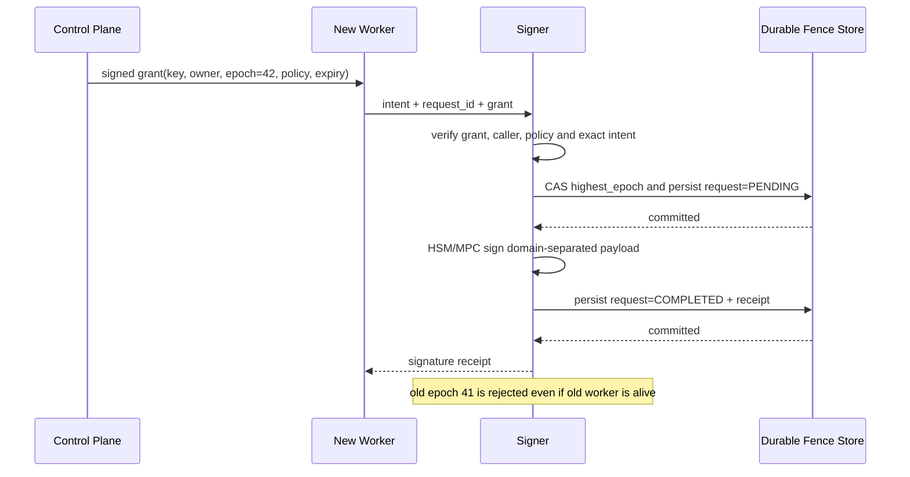

# Key Ceremony、远程签名机 Fencing 与恢复

## 30 秒版（开场）

> 签名 HA 最危险的不是“新节点起不来”，而是新旧 owner 同时可签。控制面租约只能选 leader，必须由 signer 数据面持久化并强制执行单调 epoch/fencing token；授权还要绑定 key、owner、有效期、policy digest、准确 intent digest 和 request ID。签名结果释放前要原子持久化最高 epoch 与幂等记录。Key ceremony 则覆盖生成、备份/份额、激活、轮换、停用、恢复和销毁的参与者与证据；MPC/HSM 改变密钥信任边界，但不会自动提供业务策略、抗重放或 slashing protection。

## 3 分钟版（精讲深度）

远程 signer 应独立验证：

1. 控制面 grant 的真实性、key ID、owner、单调 epoch 和有效期；
2. caller workload identity 是否与 grant owner 一致；
3. 请求的 chain/domain、交易类型、recipient、amount、calldata、fee 与 policy version；
4. request ID 是否已签过同一 digest，是否被复用于不同内容；
5. 链特有安全状态，如 nonce/UTXO reservation、validator slashing history；
6. 审计记录与签名释放的持久化顺序。

EIP-3030 本身也明确指出：远程 BLS signer API 可能被构造请求诱导产生 slashable signature，运营方仍需额外验证模块。API 标准不是安全策略。

## 10 分钟版（状态机 + 故障边界）



### 为什么 lease 不等于 fencing

旧 leader 可能在 GC pause、网络分区或租约服务超时后继续运行。若 HSM 只认证 client certificate，不检查 epoch，它无法知道所有权已转移。fencing 的判断必须位于最终副作用边界；数据库写通常用 token/CAS，签名则由 signer 或其强一致状态层拒绝旧 epoch。

多个 signer replica 各自只在内存保存 `highest_epoch` 也不安全：两个副本可能分别接受新旧 owner。需要单写 owner、线性化状态存储，或由底层密码模块/协议提供等价的全局互斥与历史保护。

### 幂等不是“相同 request ID 一律成功”

- 同一 `request_id + intent_digest + policy_digest`：返回原签名/receipt，不二次产生副作用。
- 同一 request ID、不同 digest：安全冲突，进入调查，不覆盖原记录。
- 相同交易意图、不同 request ID：是否允许由业务策略决定；提现通常还需 intent 唯一键。
- epoch 升级后旧 request 重试：先执行 stale-epoch 检查，再决定是否返回历史 receipt，避免旧 owner 探测或驱动新操作。

### 崩溃恢复不是“密码操作 exactly once”

新的 epoch 与 `PENDING` reservation 应先提交，再调用 HSM/MPC。否则 backend 超时或失败导致
事务回滚时，旧 epoch 会重新获得机会。密码结果产生后则先提交 `COMPLETED + receipt`，再把
签名释放给调用方。

进程若恰好在密码操作成功、receipt 提交前崩溃，外部尚未拿到签名，但恢复时可能再次调用
密码后端；分布式系统不能仅凭本地数据库宣称“密码调用 exactly once”。要避免重复消耗
MPC nonce/preprocessing 或产生不同签名，backend 还需提供持久 session、请求幂等与恢复查询。

### Key ceremony 交付物

| 阶段 | 必须证明的内容 |
|------|----------------|
| 生成/DKG | 算法与参数、participant 身份、环境完整性、无明文 key、public key 对照 |
| 备份/reshare | 份额版本、threshold、地域/人员分离、旧份额失效规则、恢复可用性 |
| 激活 | key purpose、chain/domain、policy、额度、owner epoch、监控和审批 |
| 轮换/迁移 | 新旧 key 并行窗口、资金迁移、地址/withdrawal credential、历史保护状态 |
| 停用/销毁 | 阻断调用、链上权限撤销、备份处理、证据保留和法规/业务保留期 |

Key rotation 可能只是更换材料；地址、合约角色、validator withdrawal credential 或用户资金迁移是另一个业务状态机，不能混为一个按钮。

### Validator 的额外边界

通用 fencing 不能替代 slashing protection。EIP-3076 要求导入/导出 signing history 时停止 validator client/signer，以免导出过期历史，并要求处理历史空洞和低水位。迁移时必须保证旧 signer 停止、新 signer 已导入并合并正确历史，再恢复职责；“复制 key 后两边观察几分钟”可能直接造成双签。

## 可运行示例

```bash
go test -race ./examples/senior/signerfencing/...
(cd examples/signer-project && go test ./...)
```

前一个 `signerfencing` 示例使用 Ed25519 认证 control-plane grant 和 signer receipt；grant
密码学绑定 `request_id + intent_digest + policy_digest`，调用入口另接收由认证传输层给出的
workload identity，并验证 stale epoch、same-epoch owner conflict、过期授权与并发 request-ID
冲突。它刻意使用内存状态，不代表生产持久化、mTLS/SPIFFE 身份提取或区块链签名实现。

`examples/signer-project/` 是下一层项目化验证：bbolt 持久化 monotonic fence、`PENDING` 与
receipt，重启后仍拒绝旧 owner；同一 Backend contract 可运行软件测试 signer、SoftHSM2
PKCS#11 P-256，以及单进程 2-of-3 FROST Taproot/BIP-340 sandbox。边界必须如实表述：bbolt
文件锁使这个实现是 **single-active**，不是多副本线性化数据库；SoftHSM 是 PKCS#11 软件
token，不提供硬件防护；FROST 确实执行 DKG/门限签名协议，但 demo 的 participant、share 和
transport 未跨主机隔离，而且所用上游库自身也声明仍需更多测试与审计，不能直接作为生产托管方案。

生产化扩展保留上述教学版，并另外提供三条可验收路径：

1. `fence.EtcdSigner` 使用 etcd 默认线性一致读、lease-backed per-key mutex 和
   `Mutex.IsOwner()` transaction compare；阶段 A/C 同时比较 lock ownership 与
   state/request revision。进程内仍需 per-key lock，因为共享同一 etcd Session 的锁语义
   不能被误当成同进程并发互斥。
2. `cmd/hsm-acceptance` 只允许 existing key，固定 token selector、`CKA_ID/CKA_LABEL`
   与独立 SPKI SHA-256，检查 ECDSA mechanism/安全属性、并发签名和重连身份。SoftHSM
   能验证 PKCS#11 路径，但不能作为物理 HSM、固件/FIPS、HA 或审计证据。
3. `backend/frostcluster` 把 participant 分成独立进程，每个进程只加载自己的 share；
   coordinator 只保存公开 session metadata 与 protocol messages。生产通道要求 mTLS；
   loopback bearer token 只允许本机测试。当前 share file 的 plaintext/static AES-GCM
   模式都不是 HSM/KMS-backed share protection。participant 会在协议 handler 创建前同步
   写入 bbolt session ledger，跨进程重启拒绝旧 DKG/signing session；严格 CBOR decoder
   也补住固定 Taurus 版本吞解码错误的上游边界。coordinator 重启仍会中止活跃 session，
   share 与 ledger 的备份回滚也需外部单调版本/不可回滚日志防护，因而仍不是经过审计的
   托管产品。

etcd 线性一致只约束 fence metadata 和 receipt commit。旧副本在 HSM 调用期间失去 lease
时，`IsOwner` 能阻止它提交/释放 receipt，却不能撤销设备已经完成的签名；如果旧副本与
etcd 分区但仍能访问 HSM，新副本还可能在 lease 到期后开始另一轮调用。要把这种窗口也
封死，必须让 HSM/MPC participant 自身验证 fencing token/session authority，或把密钥调用
资格置于同一强制边界，不能宣传“上了 etcd 就实现 backend exactly-once”。

## 生产场景

- **MPC coordinator 切换**：每个 participant 也应验证 session ID、epoch、完整 message digest 和 policy evidence，不能只由 coordinator 口头声明。
- **HSM 集群切换**：确认 key replication、audit counter 和 fencing state 的一致性；HA 设备可用不等于应用 owner 唯一。
- **灾难恢复**：演练应从隔离备份恢复到新的信任域，并证明旧环境已失去授权，而不只是“能导入 key”。
- **怀疑密钥泄露**：暂停相关策略、保全审计、轮换链上权限/资产；仅删除云 secret 不会撤销已泄露私钥。

## 排查与工具

核心指标：stale epoch reject、same-epoch owner conflict、request digest conflict、grant expiry、policy mismatch、签名延迟、HSM/MPC round failure、持久化失败、audit sink lag。高风险拒绝不能被通用重试中间件无限重试。

## 架构取舍

严格同步持久化会增加签名延迟，却是避免 signer 重启遗忘 epoch/request 状态的必要成本。
它仍不能单独消除“后端已经签完、receipt 尚未提交”的窗口；该窗口还要靠 HSM/MPC session
幂等、nonce 生命周期和最终副作用方 fencing。可通过每 key shard、批量审计副本和硬件并行
扩展，但不能把安全状态异步落库后先返回签名。

## 深挖问答

1. **为什么有分布式锁还要 fencing？** → 锁租约过期后旧持有者仍可能执行；最终副作用方必须比较单调 token。
2. **epoch 放在 coordinator 检查可以吗？** → 不够；被隔离或被接管的 coordinator 仍可直接调用 signer。
3. **M-of-N 是否阻止恶意提现？** → 只要合法或被接管的 quorum 同意就能签，仍需意图策略、身份、限额和审计。
4. **签名成功、幂等记录落库失败怎么办？** → 不应先释放签名；需要 crash-safe 状态边界和恢复查询。
5. **DR 成功的判据？** → 新环境可安全签、历史与策略完整、旧环境被 fenced/revoked，并有证据证明。

## 反模式与事故

- 只依赖 Kubernetes leader election，所有 replica 都持有可直接签名的长期凭证。
- grant 只包含 key ID，不绑定 intent、policy、owner、epoch 与过期时间。
- 签名先返回，再异步写幂等表；崩溃后相同 request 可能被当成新请求。
- 轮换时同时启动两个 validator signer，或导入过期 slashing protection 文件。
- 把“有 HSM 审计日志”当成业务意图已经授权的证明。

## 延伸阅读

- [NIST SP 800-57 Part 1 Rev.5](https://csrc.nist.gov/pubs/sp/800/57/pt1/r5/final)
- [EIP-3030 BLS Remote Signer HTTP API](https://eips.ethereum.org/EIPS/eip-3030)
- [EIP-3076 Slashing Protection Interchange](https://eips.ethereum.org/EIPS/eip-3076)
- [bbolt](https://pkg.go.dev/go.etcd.io/bbolt)
- [etcd API：默认线性一致读与事务](https://etcd.io/docs/v3.6/learning/api/)
- [etcd API guarantees](https://etcd.io/docs/v3.6/learning/api_guarantees/)
- [AWS CloudHSM PKCS#11](https://docs.aws.amazon.com/cloudhsm/latest/userguide/pkcs11-library.html)
- [SoftHSM2](https://github.com/softhsm/SoftHSMv2)
- [Taurus multi-party-sig](https://github.com/taurushq-io/multi-party-sig)
- [S-NODE-03 Validator 与 Slashing](../19-node-rpc-staking/S-NODE-03-validator-staking-slashing-keys.md)

## 相关链接

- [钱包概念地图](../../maps/wallet-custody.md)
- [MPC/TSS 托管签名](../12-blockchain-web3/S-BC-10-mpc-tss-custody.md)
- [托管 ≠ MPC](../../maps/confusion-cards.md#custody-vs-mpc)
