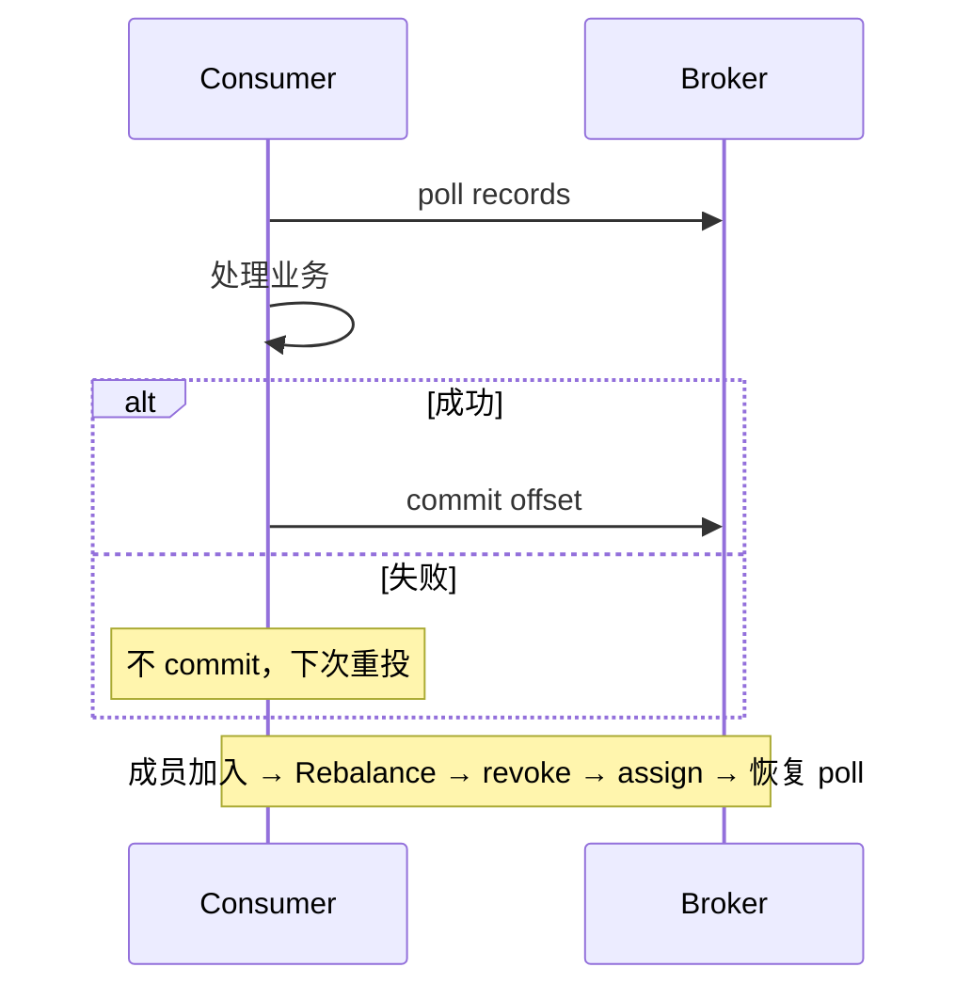

# Kafka 消费语义与 Rebalance

## 30 秒版（开场）

> Kafka 消费分 **at-most-once / at-least-once / Kafka 边界内 exactly-once**；Consumer Group 通过 Rebalance 分配 partition。Eager rebalance 会全量 revoke，cooperative 协议只迁移必要分区，但受影响分区仍会出现消费停顿和重复窗口。

## 3 分钟版（精讲深度）

1. **是什么**：Consumer Group 内多个 consumer 分摊 topic partition；offset 提交决定语义；Rebalance 在成员增减、订阅变化、session 超时时触发 partition 重分配。
2. **为什么**：水平扩展消费吞吐；partition 内有序、跨 partition 无序；错误 commit 策略导致丢消息或重复。
3. **怎么做**：业务侧用同事务 inbox/去重实现 effectively-once；手动推进 offset；使用 cooperative assignor、static membership 等减少迁移。`session.timeout.ms`、`max.poll.interval.ms` 等名称和行为取决于客户端，Go 库不能机械照搬 Java 配置。

## 10 分钟版（原理 + 图示）

**三种语义**

| 语义 | 做法 | 风险 |
|------|------|------|
| At-most-once | 先 commit 再处理 | 处理前 crash 丢消息 |
| At-least-once | 先处理再 commit | 重复消费 |
| Exactly-once | Kafka 事务提交输入 offset 与 Kafka 输出，消费者 `read_committed` | 只覆盖 Kafka 边界；外部系统仍要幂等 |



**Rebalance 流程（简化）**：Group Coordinator 协调成员与新 assignment。Classic group protocol 下常见 join/sync 流程；新 consumer group protocol 的分配与 heartbeat 由 broker 协议演进，但“成员变化会迁移 partition”这一业务后果不变。Eager 模式先 revoke 全部分区再 assign；Cooperative Sticky 逐步只迁移必要分区，减少但不消除停顿。Cooperative 迁移要求组内客户端/assignor 兼容，不能在混用不兼容策略时直接宣称已实现增量 rebalance。

**超时配置边界**：Java client 在 classic protocol 下使用客户端 `heartbeat.interval.ms`/`session.timeout.ms`；使用 `group.protocol=consumer` 时 heartbeat 周期和 session timeout 由 broker 的 consumer-group 配置控制。`max.poll.interval.ms` 约束 Java consumer 两次 poll 之间的上限，后台 heartbeat 并不能绕过它；Go 客户端的 API、处理模型和配置名不同，必须按所选库与版本核对。

**Go 客户端**：`segmentio/kafka-go` Reader 自动 commit 可关；`IBM/sarama` ConsumerGroup 实现 `Setup/Cleanup/ConsumeClaim`，在 claim 内 mark offset。不要把 Java 的“pause + 后台 heartbeat”步骤机械翻译成 Go 方案。

## 生产场景

- **订单创建 MQ**：消费写 DB + 发通知，at-least-once + `order_id` 唯一索引幂等。
- **发布 consumer 扩缩容**：K8s HPA 触发 rebalance，短暂 lag 飙升 → 用 cooperative + 限制并发扩缩。
- **长任务消费**：优先拆小任务、把耗时工作持久化后快速确认，或按客户端能力维护有界 in-flight 与连续提交水位。Java 即使仍在 heartbeat，超过 `max.poll.interval.ms` 也可能触发离组/重分配；Sarama、kafka-go 的超时与 claim 生命周期需分别验证，不能用“手动 heartbeat”作为通用绕过方案。

## 排查与工具

| 工具 | 用途 |
|------|------|
| `kafka-consumer-groups.sh --describe` | lag、consumer 状态 |
| Broker JMX / UI (AKHQ) | rebalance 速率 |
| 消费端日志 | rebalance 原因、revoke 耗时 |
| OpenTelemetry | 端到端延迟 |

路径：lag 堆积 + P99 尖刺 → 是否频繁 rebalance → 看 `MAX_POLL_INTERVAL` 超时日志 → 消费逻辑是否同步阻塞。

## 架构取舍

| 方案 | 适用 | 不适用 |
|------|------|--------|
| 手动 commit + 幂等 | 默认首选 | 无幂等存储 |
| 自动 commit | 日志采集、可丢 | 订单/支付 |
| Cooperative rebalance | 大 partition 数、组内客户端与 assignor 均兼容 | 混用不兼容客户端/分配策略或迁移流程未完成 |
| 单 partition 单 consumer | 严格顺序 | 吞吐不足 |
| 死信队列 DLQ |  poison message | 无运维回放 |

## 深挖问答

1. **partition 数怎么定？** → 目标并行度 ≥ consumer 数；过多增加文件句柄与 rebalance 成本。
2. **重复消费怎么防？** → 业务唯一键；去重/inbox 记录与业务变更同数据库事务。单独 Redis SETNX 存在崩溃窗口，不能自动保护 DB 或外部副作用。
3. **Rebalance 为何慢？** → Eager 全量 revoke；消费端 `onRevoked` 同步 commit 阻塞。
4. **消费顺序？** → 仅 partition 内有序；key 相同进同 partition。
5. **Go 里 graceful shutdown？** → SIGTERM → 停止 poll → 处理 in-flight → commit → LeaveGroup。

## 反模式与事故

- 消费逻辑里同步执行不可控的长 HTTP/RPC；Java client 的 `max.poll.interval.ms` 默认值虽常见为 5 分钟，但这不是所有 Go 客户端的通用默认，超时仍会造成重分配与重复窗口。
- 自动 commit + 批处理 halfway crash——丢一批消息无感知。
- 扩 consumer 超过 partition 数—— idle consumer 浪费且增加 rebalance。
- 忽略 `context.Cancel`——Pod 终止时 offset 未提交大量重复。

## 代码示例

```go
// segmentio/kafka-go：处理成功后再 commit
reader := kafka.NewReader(kafka.ReaderConfig{
    Brokers:     []string{"kafka:9092"},
    GroupID:     "order-worker",
    Topic:       "orders",
    CommitInterval: 0, // 手动 CommitMessages
})
for {
    msg, err := reader.FetchMessage(ctx)
    if err != nil {
        break
    }
    // 顺序处理时，不要失败后继续拉同一 partition 的更高 offset，
    // 否则之后提交高 offset 会把失败消息一并跨过。
    if err := handleWithRetryOrDurableDLQ(ctx, msg); err != nil {
        break
    }
    if err := reader.CommitMessages(ctx, msg); err != nil {
        // commit 失败意味着消息可能重投，业务处理必须幂等。
        break
    }
}
```

`kafka-go` 的 `CommitMessages` 会把传入 partition 中的最高 offset 之前都视为已处理；若并行处理同一 partition，必须维护连续完成水位，不能谁先完成就提交谁。

## 延伸阅读

- [Kafka 4.1 Consumer Configs](https://kafka.apache.org/41/configuration/consumer-configs/)
- [Kafka Message Delivery Semantics](https://kafka.apache.org/41/design/design/)
- [Cooperative Rebalancing](https://www.confluent.io/blog/cooperative-rebalancing-in-kafka-streams-consumer-ksqldb/)
- [kafka-go Reader](https://github.com/segmentio/kafka-go#reader)
- [S-KAFKA-01 架构与 ISR](./S-KAFKA-01-architecture-storage.md)
- [S-KAFKA-02 Producer 可靠性](./S-KAFKA-02-producer-reliability.md)
- [S-KAFKA-03 交易事件总线](./S-KAFKA-03-trade-event-bus.md)
