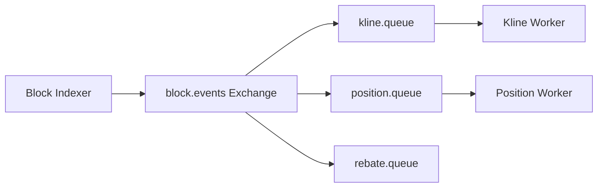

!!! tip "相关主题"
    场景地图见 [Web3 交易所与钱包](../../../web3-exchange-wallet-focus.md)。

# RabbitMQ 拆分链上监听与业务写入

<a id="oral-card"></a>

## 要点卡

[返回 P0 知识图谱](../../_meta/p0-knowledge-graph.md)

!!! abstract "30 秒回答"

    RabbitMQ 用 exchange 将同一链事件路由到相互隔离的业务队列，避免慢写库阻塞其他投影。
    可靠性要把两条确认链分开：Publisher Confirm 只说明 broker 已接管发布，手动 ACK 只说明
    当前 delivery 已被消费者确认；二者都不等于外部数据库天然 exactly-once。消费者先做
    业务幂等再 ACK，失败按可重试/毒消息分类进入有界重试或 parking queue。

**3 分钟展开**

1. 发布端使用 durable/quorum queue、持久消息、confirm 和 mandatory/return 处理未路由消息；confirm 未知时重发仍可能重复。
2. 消费端设置 prefetch 和处理 deadline；连接丢失时未 ACK delivery 可能自动重投，所以写库必须有 event identity/唯一约束。
3. `nack(requeue=true)` 可能形成热循环；`requeue=false` 只有配置 DLX 时才会死信，否则可能被丢弃。
4. 链事件还要携带 block hash、log ordinal 和 canonical/finality 状态；MQ 可靠不能替代 reorg 回滚与补扫。

| 记忆槽 | 内容 |
|--------|------|
| 三个不变量 | confirm 与 ACK 正交；至少一次必须业务幂等；链消息保留 lineage/finality |
| 手画图 | `indexer → topic exchange → isolated queues → idempotent workers → DB` |
| 项目落点 | Launchpad 类 DEX 讲 K 线/持仓/返佣独立队列、parking queue 与区块补扫 |
| 一个取舍 | RabbitMQ 路由和任务队列语义直接，但长保留、大规模重放和日志流要重新评估 Kafka 等方案 |

**错误表达**

- ❌ “Publisher Confirm 代表消费者写库成功；`nack(false,false)` 一定会进 DLQ。”
- ✅ “Confirm 只到 broker；是否 dead-letter 取决于 DLX 配置，消费副作用仍需幂等和对账。”

**自测追问**：连接在写库成功后、ACK 前断开，会发生什么？如何防止重复返佣？

## 10 分钟版（拓扑）



| 模式 | 用途 |
|------|------|
| Topic Exchange | 按有界的事件域/版本路由；避免按每个 token 动态创建海量 binding |
| 手动 ACK | 处理成功再 ack；失败按错误类型选择重试或停车 |
| DLX + TTL | `requeue=false` 后由死信交换机进入延迟重试/parking queue |
| Prefetch | 限制 unacked 防 OOM |

**Go 客户端要点**（`amqp091-go`）

```go
ch.Qos(prefetch, 0, false) // 限制未确认消息数，不保证绝对公平
deliveries, _ := ch.Consume(queue, "", false) // autoAck=false
for d := range deliveries {
    if err := handle(d.Body); err != nil {
        // requeue=true 会回原队列，毒消息可能立即热循环；
        // requeue=false 才会在配置了 DLX 时进入死信/延迟重试拓扑。
        _ = d.Nack(false, false)
        continue
    }
    _ = d.Ack(false)
}
```

## 生产场景

- **监听与写入解耦**：消息成功发布后，队列能吸收消费者写库抖动；它不能修复发布前的 RPC 漏块，
  所以 indexer 仍需 cursor、补扫和区块证据
- **与 Kafka 选型**：不要只背吞吐高低；比较路由/投递、保留与重放、顺序范围、消费模型、
  运维经验和实测 workload（[S-RMQ-03](../rocketmq/S-RMQ-03-vs-kafka.md)）

## 深挖问答

1. **消息丢失？** → Publisher Confirm + durable/quorum queue + persistent message + 消费手动 ACK；仍要处理连接恢复和 confirm 未知结果导致的重复发布。
2. **顺序性？** → 单 queue + Single Active Consumer 可保持主要交付顺序，但 redelivery、优先级和失败重试会影响观察到的顺序；业务仍应带 sequence。
3. **和 Kafka/RocketMQ 对比？** → 先说明任务队列还是可重放事件日志，再比较路由、保留、
   顺序、延迟、客户端与团队运维能力，不按公司/链类型给出绝对结论。

## 反模式

- autoAck=true → 处理失败丢消息
- 所有事件一个 queue → 慢消费者阻塞快路径
- 无 DLX → 毒消息无限 requeue
- 只保证 MQ delivery，不保存区块 hash/finality → reorg 后错误投影无法可靠回滚

## 延伸阅读

- [S-BC-05 索引器](../../12-blockchain-web3/S-BC-05-indexer-reorg.md)
- [S-RMQ-03 RocketMQ vs Kafka](../rocketmq/S-RMQ-03-vs-kafka.md)
