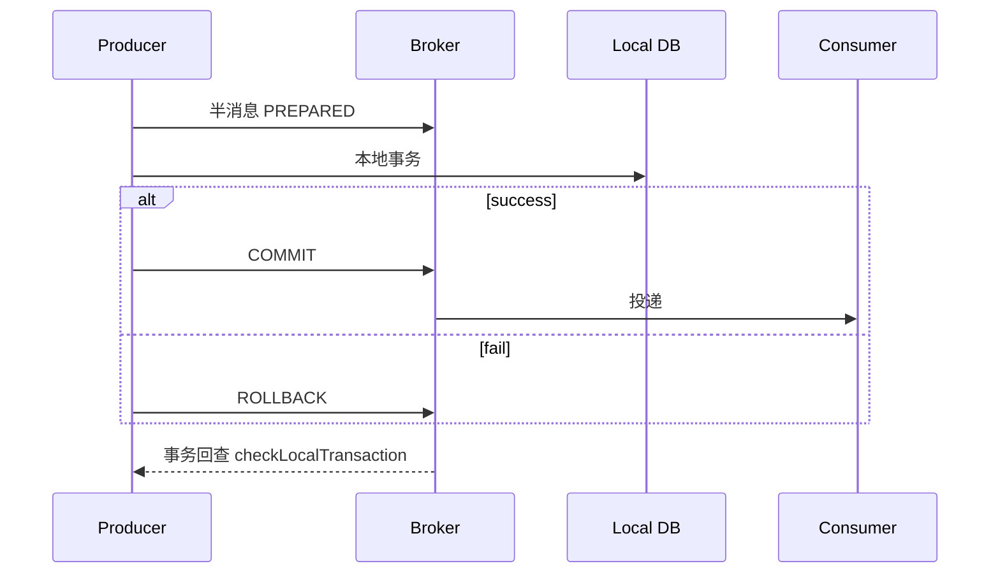

# RocketMQ 顺序消息、事务消息与延迟消息

## 30 秒版（开场）

> **顺序消息**：同一消息组/Queue 内维持 FIFO；**事务消息**：半消息 → 本地事务 → commit/rollback/回查，缩小“写库成功但消息未发”的窗口，最终仍依赖本地事务状态、回查和消费幂等；**延迟消息**要区分 4.x 固定级别与 5.x 定时时间戳及其范围限制。

## 3 分钟版（精讲深度）

1. **顺序**：全局顺序单 Queue（吞吐低）；分区顺序用 ShardingKey hash 到固定 Queue；消费端 **MessageListenerOrderly** 单线程 per Queue。
2. **事务**：`sendMessageInTransaction` → Broker 存半消息（对消费者不可见）→ 执行本地事务 → `commit` 后可见或 `rollback` 后丢弃；若 broker 没拿到确定结果会**回查**本地事务状态。
3. **延迟**：**RocketMQ 4.x**：`setDelayTimeLevel(n)`，18 档（1s…2h），非任意 timestamp。**5.0+**：支持 `DELIVERY_TIMESTAMP` 任意时刻；老系统仍常见 18 档。

## 10 分钟版（原理 + 图示）

**事务消息流程**



| 类型 | 关键点 | 坑 |
|------|--------|-----|
| 顺序 | ShardingKey 同 key 同 Queue | 消费失败阻塞该 Queue |
| 事务 | 回查接口必须可靠 | 回查风暴、状态不明 |
| 延迟 4.x | 18 固定级别 | 非任意 timestamp |
| 延迟 5.x | 按定时时间戳投递 | 有最大时间范围等 broker 限制，API 与 4.x 不同 |


## 生产场景

- **订单状态机**：同一 orderId 顺序消费状态变更
- **支付成功发积分**：事务消息保证「账已记才发 MQ」
- **30 分钟未支付关单**：延迟 level 或延迟 Topic + 定时扫描

## 排查与工具

- 事务消息堆积在 `RMQ_SYS_TRANS_HALF_TOPIC`
- 顺序消费卡住：看该 Queue  offset 是否停在某条 poison message
- DLQ：`%DLQ%{consumerGroup}`

## 架构取舍

| 方案 | 适用 |
|------|------|
| RocketMQ 事务消息 | 已有 RocketMQ、接受回查 |
| 本地消息表 / Outbox | 任意 MQ、DB 同事务写 outbox |
| Saga/TCC | 跨多服务长事务 |

## 深挖问答

1. **顺序消息消费失败？** → 重试阻塞同 Queue；需 skip 策略或 DLQ + 人工。
2. **事务回查做什么？** → 查本地事务表/订单状态，返回 COMMIT/ROLLBACK/UNKNOWN。
3. **延迟不准？** → 4.x level 粒度粗；5.x 到期时间也不等于业务代码精确在该毫秒执行，仍受 broker/consumer 排队影响。海量同一时刻任务还会形成峰值。
4. **和 Kafka 事务？** → Kafka 事务是 broker 层原子写多分区；RocketMQ 是业务本地事务 + 半消息。

## 反模式与事故

- **所有消息都走顺序** → 吞吐暴跌
- **回查逻辑返回 UNKNOWN 过久** → 半消息堆积
- **延迟 level 当精确调度** → 业务时间误差

## 代码示例

```go
// 顺序发送：同一 orderID 作为 ShardingKey
msg.WithShardingKey(orderID)

// 延迟：level 3 通常为 10s（以 broker 配置为准）
msg.WithDelayTimeLevel(3)
```

## 延伸阅读

- [RocketMQ 顺序消息（FIFO）](https://rocketmq.apache.org/docs/featureBehavior/03fifomessage/)
- [事务消息](https://rocketmq.apache.org/docs/featureBehavior/04transactionmessage/)
- 关联：[S-ARCH-11 延迟任务](../../03-system-design/S-ARCH-11-delayed-jobs.md)
