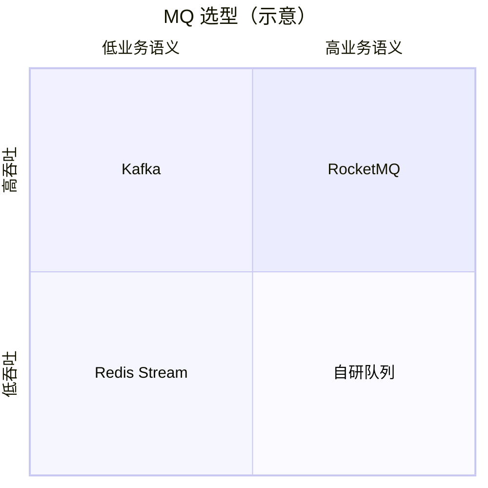

# RocketMQ 与 Kafka 选型对比

## 30 秒版（开场）

> **Kafka** 强项：**超高吞吐、日志流、生态（Flink/Connect）**；分区有序、副本 ISR。**RocketMQ** 强项：**事务消息、延迟级别、Tag 过滤、国内运维经验**。Go 后端选 MQ 看 **语义需求** 而非单纯 QPS。讲解要点：**场景 + 一致性 + 运维 + 团队熟悉度**。

## 3 分钟版（精讲深度）

| 维度 | Kafka | RocketMQ |
|------|-------|----------|
| 定位 | 分布式日志 / 流平台 | 业务型 MQ |
| 吞吐 | 极高 | 高（万级 TPS 足够多数业务） |
| 顺序 | 分区内有序 | Queue 内有序 |
| 延迟消息 | 无通用原生延时队列，通常应用层实现 | 4.x delay level；5.x 定时时间戳 |
| 事务消息 | 幂等 + 事务 API | 半消息 + 回查 |
| 消费模型 | Consumer Group + partition 绑定 | Consumer Group + Queue 负载均衡 |
| 运维 | KRaft/ZK，分区再均衡 | NameServer + Broker 主从 |
| 生态 | 大数据主流 | 国内云、电商 |

## 10 分钟版（架构取舍）

**选 Kafka**

- 日志采集、埋点、CDC 入湖
- 百万级吞吐、多消费者独立读同流
- 团队已有 Kafka Connect / Flink 流水线

**选 RocketMQ**

- 订单、支付、通知等业务 MQ
- 需要 **事务消息、定时/延迟投递**，并且团队能处理版本限制与回查
- 国内部署文档、云厂商托管成熟

**Go 服务注意**

- 均需 **消费幂等**（at-least-once）
- Rebalance 期间可能重复/短暂不可用
- 大消息：Kafka `max.message.bytes`；RocketMQ 默认 4MB 可调

## 生产场景

- 字节/阿里系 JD：常问 Kafka 消费语义 + 若做过电商会问 RocketMQ 事务
- 双 MQ 并存：日志走 Kafka，核心业务走 RocketMQ（成本与复杂度上升）

## 深挖问答

1. **两者都是拉消费？** → Kafka poll；RocketMQ Push 实为长轮询拉。
2. **谁更适合顺序？** → 都靠 key 绑定固定分区/Queue；Kafka 分区数决定并行度。
3. **Exactly-once？** → 两端业务消费通常仍按 at-least-once 设计；Kafka EOS 主要覆盖 Kafka 内 read-process-write，RocketMQ 事务消息解决的是本地事务与消息可见性的协调，都不自动包含任意外部副作用。
4. **迁移成本？** → Topic 模型、客户端、运维工具全换；用 **双写 + 对账** 渐进。

## 反模式与事故

- **日志型 Kafka 任务用超大消息** → broker 压力
- **为统一而强行只留一种 MQ** → 场景不匹配
- **不看消费组 Rebalance 策略** → 重复消费打爆下游

## 延伸阅读

- [Kafka 文档](https://kafka.apache.org/documentation/)
- [S-KAFKA-01 架构与 ISR](../kafka/S-KAFKA-01-architecture-storage.md)
- [Kafka 消费语义](../kafka/S-DIST-04-kafka-semantics.md)
- [MQ 通用语义](../../03-system-design/S-ARCH-10-mq-semantics.md)
